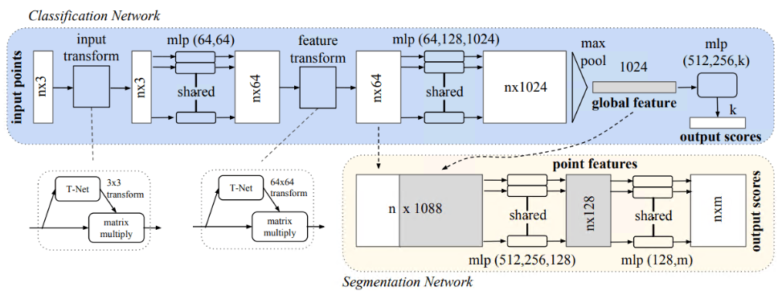
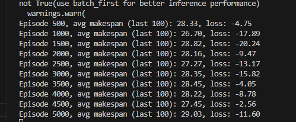

- 点群入力の向きを揃えるために，変換行列を求める学習(T-Net)を最初に行う
- 特徴ベクトルを算出した後も，特徴ベクトルを揃えるための？学習をT-Netで行う
- 各点への特徴ベクトル算出処理が終わったらmax poolingで各点の特徴を点群全体の特徴にまとめる．この時，max poolingを使うことで，点群の順番に依存しない学習が行える
- Classification Networkはこうして求められた点群全体の特徴ベクトルを，クラス数にまとめてクラスを算出&学習(点群:ラベル のデータ)
- Segmentation Networkは，点群全体の特徴ベクトルと各点の特徴ベクトルをつなげて各点のラベルを算出&学習(点:ラベル のデータ)

## モデル精度
1. AttentionNetを使って学習
dim = 32 →全然ダメ
このサイズではさすがに探索できないか？
というかほとんど改善してないような。。。

