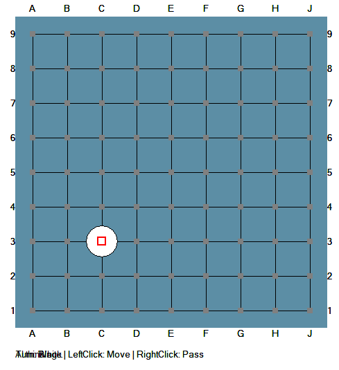
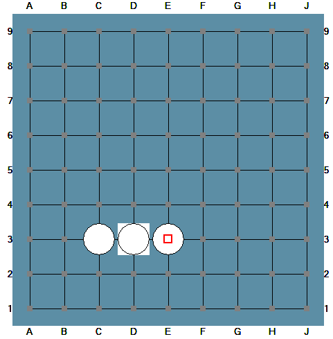

強化学習の練習をいつもやっているPythonではなく、C++で実装してみたいと思いました。
今回はその一回目として碁をC++で実装するについて扱います。

## C++で碁の実装

以下、前回の **Win32 API GUI 版囲碁（9路盤）** のコードを、**囲碁のルールと完全に対応させながら**、構造と実装手順を解説いたします。

### 1. プロジェクト作成（Visual Studio 2022）

__Step 1: 新規プロジェクト__
1. **「新しいプロジェクトの作成」** → **「空のプロジェクト」**（C++）→ 名前: `GoGUI`
2. **ソースファイル** を右クリック → **「追加」** → **「新しい項目」** → `main.cpp`

__Step 2: プロパティ設定（必須）__
1. プロジェクトを右クリック → **「プロパティ」**
2. **リンカー** → **システム** → **サブシステム** → **「Windows (/SUBSYSTEM:WINDOWS)」**
3. **C/C++** → **言語** → **C++言語標準** → **「ISO C++17 標準」**（または C++14）

### 2. コード全体の構造

囲碁のルールをプログラムで再現するために、コードは以下の4つの層に分かれています。

| 層 | ファイル内の位置 | 囲碁における役割 |
|---|---|---|
| **ルール層** | `GoBoard` クラス | 石を打つ、連、気、コウ、捕獲、地計算 |
| **思考層** | `RandomAgent` クラス | 次の一手を選ぶ（今回はランダム） |
| **表現層** | `DrawBoard`, `DrawStone` | 盤・石・星の目・座標を画面に描画 |
| **制御層** | `WndProc`, `wWinMain` | 手番管理、マウス入力、AIの非同期実行 |

### 3. ルールとコードの対応解説

__3.1 盤面と石の表現__

**囲碁のルール**: 碁盤は縦横9路の交点に、黒または白の石を置く。交点には最大1個の石しか置けない。

```cpp
enum class Stone { EMPTY = 0, BLACK = 1, WHITE = 2 };

class GoBoard {
    std::vector<Stone> board;  // 81マス（9x9）を1次元配列で管理
```

- `board[y * SIZE + x]` で交点 `(x, y)` の状態を保持します。
- `EMPTY`（空点）、`BLACK`（黒）、`WHITE`（白）の3状態を `enum class` で厳密に区別しています。

__3.2 連（いわし）の管理__

**囲碁のルール**: 隣接する同色の石は「連」になり、まとめて扱われる。

```cpp
mutable std::vector<int> parent;  // Union-Find（併合集合）の親配列
```

- **Union-Find（素集合データ構造）** を使い、隣接する同色の石を自動的に1つの「連」としてグループ化します。
- `unite()` で連を結合、`find_root()` で所属する連の代表を取得します。

```cpp
void unite(int a, int b) const {
    a = find_root(a); b = find_root(b);
    if (a == b) return;
    if (a > b) std::swap(a, b);
    parent[b] = a;  // bの連をaの連に統合
}
```

__3.3 気（liberties）の計算__

**囲碁のルール**: 連のまわりの空点の数が「気」。気が0になるとその連は盤上から取り除かれる（捕獲）。

```cpp
mutable std::vector<int> liberties;  // 各連の気の数

void reset_union_find() const {
    // 1. 各石を独立した連として初期化
    // 2. 隣接する同色の石をuniteで統合
    // 3. 各空点について、隣接する連の気を+1
    for (int r : roots) liberties[r]++;
}
```

- 着手のたびに盤面全体から気を再計算します（9路盤なので十分高速です）。
- `liberties[root]` がその連の生きる余地（気の数）になります。

__3.4 着手と捕獲__

**囲碁のルール**: 石を打つと、まず隣接する相手の連の気が0になっていないか確認する。0になっていればその連を盤から取り除く。

```cpp
bool place_stone_raw(int x, int y, Stone color, int& out_captured, int& out_new_ko) {
    board[idx] = color;  // 仮に石を置く
    
    // 4方向の相手の連をチェック
    for (int d = 0; d < 4; ++d) {
        int root = find_root(nidx);
        if (liberties[root] == 0) {
            // この連の石をすべてEMPTYにする（捕獲）
            for (int i = 0; i < SIZE * SIZE; ++i)
                if (find_root(i) == root) board[i] = Stone::EMPTY;
        }
    }
}
```

- 石を置いた直後に `reset_union_find()` を呼び、相手の連の気を再評価します。
- 気が0の連は `Stone::EMPTY` に戻され、盤上から消えます。

__3.5 自殺手（自殺点）の禁止__

**囲碁のルール**: 自分の石を置いた結果、自分の連の気が0になる着手は禁止（自殺手）。

```cpp
// 自殺手チェック
reset_union_find();
int my_root = find_root(idx);
if (liberties[my_root] == 0) {
    board = backup_board;  // 元に戻す
    return false;          // 着手失敗
}
```

- 相手の捕獲後、今度は自分の連の気が0になっていないか確認します。
- 0になっていればバックアップから復元し、着手を拒否します。

__3.6 コウ（劫）__

**囲碁のルール**: 1手前に1石だけを取った場合、その取られた位置に次の手番で即座に戻ると循環になるため、1手だけ着手禁止（コウ）。

```cpp
int ko_pos;  // コウの位置（-1でなし）

if (out_captured == 1) {
    out_new_ko = captured_indices[0];  // 取られた1石の位置を記録
}

bool is_legal(int x, int y, Stone color) const {
    if (idx == ko_pos) return false;  // コウ点への着手を禁止
}
```

- 1石だけ捕獲した場合、その位置を `ko_pos` に保存します。
- 次の手番でその位置への着手を `is_legal()` で弾きます。
- パスや他の場所への着手が入ると `ko_pos = -1` で解除されます。

__3.7 パスと終局__

**囲碁のルール**: 手を打つ代わりに「パス」できる。黒白連続でパスすれば対局終了。

```cpp
// 人間の右クリックでパス
void HandleRightClick() {
    g_board.play_move(GoBoard::PASS_MOVE, GoBoard::PASS_MOVE, g_human_color);
    g_pass_count++;
    CheckGameOver();  // pass_count >= 2 で終局
}
```

- `PASS_MOVE = -1` を特別な値として定義し、盤面は変更せず手番だけ交代します。
- グローバル変数 `g_pass_count` で連続パスをカウントし、2回で `g_game_over = true` になります。

__3.8 地の計算（領域 + 石数）__

**囲碁のルール**: 終局後、各プレイヤーの「領域」（囲んだ空点）と「生存している石数」を合計し、コミを加算して勝敗を決める。

```cpp
Score calculate_score() const {
    // BFSで空領域を探索
    while (!q.empty()) {
        // 領域の周囲に黒だけが隣接 → 黒の領域
        // 領域の周囲に白だけが隣接 → 白の領域
    }
    s.black_score = black_territory + black_stones;
    s.white_score = white_territory + white_stones + KOMI;  // 白にはコミ6.5点
}
```

- 空点の塊（領域）に対して、**幅優先探索（BFS）** を行います。
- その領域に隣接する石の色が黒のみなら黒の地、白のみなら白の地とします。
- 白には **コミ（6.5点）** を加算し、引き分け（ジゴ）を防ぎます。

### 4. GUI（Win32 API）の仕組み

__4.1 盤面の描画__

```cpp
void DrawBoard(HDC hdc) {
    // 1. 木目調の背景を塗る
    // 2. 縦横9本の線を引く
    // 3. 星の目（5点）を描く
    // 4. 石を描く（黒：塗り潰し楕円、白：白抜き楕円）
    // 5. 最後の着手を赤枠で囲む
    // 6. 合法手に灰色のヒント点を表示
}
```

- `HDC`（デバイスコンテキスト）に対して `Ellipse`（楕円）、`LineTo`（線）、`DrawText`（文字）を使って描画します。
- 石の描画は楕円（`Ellipse`）なので、フォントや文字コードに依存しません。

__4.2 マウス入力と手番管理__

```cpp
void HandleLeftClick(int px, int py) {
    // ピクセル座標 → 盤座標（0～8）に変換
    // 合法手なら石を置き、手番をAI（黒）に渡す
    SetTimer(g_hWnd, 1, 10, NULL);  // AIの思考を非同期で開始
}
```

- **左クリック**: 石を打つ。`ToBoardCoord()` でピクセルを交点に変換します。
- **右クリック**: パス。
- AIの思考中は `g_ai_thinking = true` で入力をブロックします。

__4.3 AIの非同期実行__

```cpp
case WM_TIMER:
    KillTimer(hWnd, 1);
    DoAIMove();  // AIがランダムに一手選んで盤面を更新
    return 0;
```

- Win32 API はシングルスレッドで動くため、AIの計算中に画面が固まらないよう **タイマー（`SetTimer`）** を使って非同期に実行します。
- `Sleep(400)` で「思考中」の演出を入れ、画面を `InvalidateRect` で再描画します。

### 5. コード作成のステップバイステップ

もし一から書く場合、以下の順序で実装すると確実です。

__Phase 1: コンソール版の完成__
1. `Stone` enum と `GoBoard` クラスの骨格を作る
2. `board[x][y]` の読み書きと `print()` を実装
3. Union-Find（`parent`, `find_root`, `unite`）を実装
4. `reset_union_find()` で気を計算する
5. `place_stone_raw()` で着手と捕獲を実装
6. 自殺手チェックを追加
7. コウ（`ko_pos`）を追加
8. `calculate_score()` でBFSによる地計算を実装
9. `RandomAgent` でランダム対局をテスト

__Phase 2: GUIの接続__
10. Win32 API のウィンドウを作成（`wWinMain`, `WndProc`）
11. `WM_PAINT` で `DrawBoard()` を呼び、盤の線と星の目を描く
12. `DrawStone()` で楕円を描き、石を表示する
13. `WM_LBUTTONUP` でマウス座標を盤座標に変換し、`play_move()` を呼ぶ
14. `WM_TIMER` でAIの手を非同期に実行する
15. `WM_RBUTTONUP` でパスを実装
16. 終局判定と結果表示をステータス欄に追加

### 6. まとめ：ルールとコードの対応表

| 囲碁のルール | 実装クラス / 関数 | キー技術 |
|---|---|---|
| 盤面（9路） | `GoBoard::board` | 1次元 `std::vector<Stone>` |
| 連の形成 | `GoBoard::unite()` | Union-Find |
| 気の数え | `GoBoard::reset_union_find()` | 空点から隣接連へ加算 |
| 着手・捕獲 | `GoBoard::place_stone_raw()` | 相手連の気が0なら除去 |
| 自殺手禁止 | `GoBoard::place_stone_raw()` | 自分の連の気0で復元 |
| コウ | `GoBoard::ko_pos` | 1石捕獲時に位置を記録 |
| パス・終局 | `HandleRightClick()`, `CheckGameOver()` | `pass_count >= 2` |
| 地計算 | `GoBoard::calculate_score()` | BFS + 隣接色判定 |
| 手番管理 | `g_current_turn`, `g_human_color` | 人間（白）vs AI（黒） |
| 盤面描画 | `DrawBoard()`, `DrawStone()` | Win32 GDI (`Ellipse`, `LineTo`) |
| 非同期AI | `SetTimer()`, `DoAIMove()` | メッセージループをブロックしない |

### コンパイル

コンパイルすると以下のように番目と手が見えるようになります。



味方は□に◎印です。



## まとめ

ということでC++でもGUI付きの碁が実装出来そうです。
コード等は以下をご参考下さい。

https://github.com/Shinichi0713/Reinforce-Learning-Study/tree/main/physical_engine/chess/chess_game
