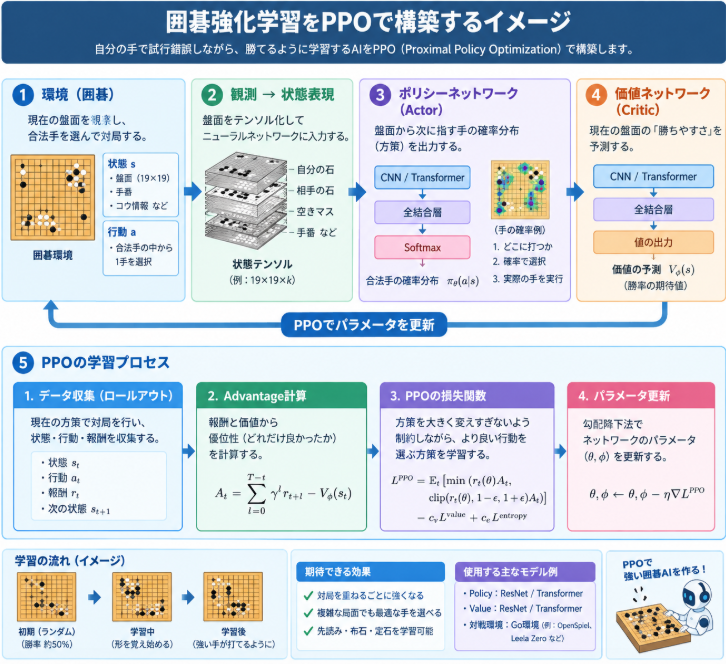

[前々回碁のC++での環境を構築](https://yoshishinnze.hatenablog.com/entry/2026/10/17/043000)し、[前回C++でPythonで学習したニューラルネットワークを動作させるPoC](https://yoshishinnze.hatenablog.com/entry/2026/10/31/043000)を行いました。

ということでPythonでモデルを構築すると、C++で動作させることが出来ることが分かりました。

今回はこの碁をプレイするエージェントを作るためのPythonコードを作成していきます。

## 実装目標

今回の実装の目的です。

- 強化学習でつよつよモデルをいきなり目指すのではなく、強化学習のエージェントとして人と対戦できるレベルのエージェントを作る。
- C++の環境で訓練したエージェントを動作させる。

いきなり最強を目指すと破綻します。。。

## 実装するもの

囲碁のエージェントを強化学習で学習させるシステムは、複数の相互作用するコンポーネントで構成されます。
全体像と主要な3つの構成要素を整理しました。

### 1. 環境モジュール

学習の「舞台」となるシミュレータが必要です。

* **状態（State）生成:** 盤面からニューラルネットワーク入力用のテンソル（3×19×19）を作成。
* **ルール判定:** 合法手・非合法手の判定、アゲハの削除、コウ（劫）やパズル終了の遷移管理。
* **報酬関数（Reward Function）:** 終局時の勝敗（勝ち: +1.0, 負け: -1.0）や、中間ステップの報酬の計算。

### 2. ニューラルネットワーク

エージェントの「脳」に当たるコンポーネントです。
価値ネットワークか、方策ネットワークの2択があります。

* **Policy Head（方策ネットワーク）:** 現在の盤面から、全交点（361マス＋パス）のどこに打つのが最適かの確率分布（$P(a\vert{}s)$）を出力。
* **Value Head（価値ネットワーク）:** 現在の盤面が自分にとってどれくらい有利か（勝率評価 $-1.0 \sim +1.0$）を予測（$V(s)$）。

### 3. トレーナー・最適化器（Trainer / Optimizer）

過去囲碁の強化学習の成功実績がある[PPO](https://yoshishinnze.hatenablog.com/entry/2026/08/10/043000)を用いて学習を行います。

PPO が過去成功した理由は、同じ自己対戦データを複数エポック再利用できる（サンプル効率）＋ 更新の暴走をclipで機械的に防げる（安定性）という２点とされています。最強を目指すのではなく、まずは動作させられるということを考えると適切なアルゴリズムと考えました。

最終的にC++で動作させるため、Adam等の最適化手法を用いてネットワークの重みを更新し、ONNXモデルとして保存とします。

システム構成図はこんな感じです。



## 環境モジュール

強化学習では「エージェントが最適化しようとしている実際の目的関数」と「人間が想定している目的（＝強い碁）」がズレていると、どんなアルゴリズムを使っても無駄になります。

### 1. 状態空間（Observation Space）の設計

環境からニューラルネットワークへ渡す盤面データ（`_get_obs`）は、CNN（畳み込み層）で処理しやすい **3×9×9 の3次元テンソル** に変換しています。

* **Channel 0（自分の石）:** 自分が黒番なら黒石のある位置に `1.0`、白番なら白石の位置に `1.0`。
* **Channel 1（相手の石）:** 相手の石がある位置に `1.0`。
* **Channel 2（手番フラグ）:** 自分が黒番なら全マス `1.0`、白番なら全マス `0.0`。

> **ポイント:** 「絶対的な色（黒/白）」ではなく「相対的な立場（自分/相手）」で入力を作ることで、1つのニューラルネットワークモデルで黒番・白番の両方を一貫してプレイできるようにしています。

### 2. 囲碁ルールの移植と判定ロジック

原則[前々回碁のC++での環境を構築](https://yoshishinnze.hatenablog.com/entry/2026/10/17/043000)をそのまま移植しました。

* **連（Group）と呼吸点（Liberties）の検出:** `_get_group_and_liberties` メソッドで、打ち下ろした石に隣接する同色の群れと空きマスを追跡します。
* **アゲハの獲得処理:** 着手時、隣接する相手の連の呼吸点が `0` になった場合、盤面から取り除いてスコア化します。
* **自殺手の禁止:** 石を置いた結果、自分の連の呼吸点が `0` かつ相手の石を1つも取れない着手は非合法手として判定・却下します。

### 3. 強化学習（Gymnasium API）との親和性

標準的な `gym.Env` インターフェースを継承しており、主要なRLライブラリ（Stable-Baselines3等）や自作のActor-Criticループでそのまま利用可能です。

* **`step(action)`:** 0〜360（$19 \times 19$）の整数を座標 $(r, c)$ に変換して着手。
* **非合法手マスク (`get_legal_actions`):** 探索効率を高めるため、非合法手（既に石がある場所や自殺手）のロジットを $-\infty$ 化して学習初期の無駄な着手を回避します。
* **報酬（Reward）設計:** アゲハ獲得時の即時報酬に加え、非合法手を打った場合には負のペナルティを返してエピソードを中断します。

## ニューラルネットワーク

AlphaZero本家のような40ブロック級のResNetではなく、9x9盤を想定した4ブロックの軽量ResNetにしています。これは「碁盤の並進対称性を活かせる畳み込みは必須だが、このタスク（終局判定なし・パスなし）にAlphaZero級の表現力は過剰」という判断です。盤サイズを19x19に上げる際は、num_res_blocksとchannelsを増やす前提で設計してあります。

## トレーナー・最適化器（Trainer / Optimizer）

PPOの実装キーポイントを説明していきます。

### 1. データ収集とパラメータ更新を明確に分離している

```python
model.eval()
for _ in range(EPISODES_PER_UPDATE):
    ...収集...
model.train()
```

PPOの核心は「収集した方策(π_old)」と「更新中の方策(π_new)」を区別することです。収集フェーズは`torch.no_grad()`かつ`model.eval()`で行い、この間に得た`old_log_probs`・`old_values`をバッチに固定値として保存します。この「収集時点のスナップショット」を保持しておくことが、後続のクリッピング処理の前提になります。

### 2. 複数局まとめてから1回更新する（`EPISODES_PER_UPDATE`）

1局だけでは分散が大きすぎるため、16局分の遷移をまとめて1つのバッチにしてから学習します。これはPPO固有というより方策勾配法全般の分散低減策ですが、後述の複数エポック再学習と組み合わせることで「集めるコストの高い自己対戦データを最大限使い切る」設計になっています。

### 3. GAE（Generalized Advantage Estimation）

```python
delta = rewards[t] + gamma * next_value - values[t]
gae = delta + gamma * lam * gae
```

単純な割引累積リターンをそのままアドバンテージにすると、バリューネットが未熟な学習初期には非常にノイジーになります。GAEはTD誤差を`λ`で指数加重平均することで、バイアスと分散のトレードオフを調整できます。`GAE_LAMBDA=0.95`はPPO論文のデフォルトに準拠していますが、`λ=1`（純粋なMC）に近づけるほど分散重視、`λ=0`（TD(0)相当）に近づけるほどバイアス重視になります。今回はエピソードが必ず終端する（`done=True`で終わる）タスクなので、終端の次状態バリュー`next_value`はブートストラップせず`0`から開始しています。

### 4. アドバンテージ正規化

```python
advantages_t = (advantages_t - advantages_t.mean()) / (advantages_t.std() + 1e-8)
```

このタスクは報酬のスケールが不均一です（通常の捕獲は0〜数個、違反時は-10）。バッチ内で平均0・分散1に正規化することで、学習率をタスクの報酬スケールに合わせてチューニングし直す必要がなくなり、学習の安定性が上がります。これはPPO実装で広く使われる標準的な工夫です。

### 5. クリップ付きサロゲート目的関数（PPOの本体）

```python
ratio = torch.exp(new_log_probs - mb_old_log_probs)
surr1 = ratio * mb_advantages
surr2 = torch.clamp(ratio, 1 - CLIP_EPS, 1 + CLIP_EPS) * mb_advantages
actor_loss = -torch.min(surr1, surr2).mean()
```

ここがPPOの核です。`ratio`は「新方策と旧方策の確率比」で、これが`1`から大きく離れる（＝方策が一度の更新で急変する）と`clamp`で頭打ちにし、`min`を取ることで**改善方向にも悪化方向にも行き過ぎた更新にペナルティを与えます**。これにより、素のActor-Criticで起きがちな「たまたま良かった1局に過剰反応して方策が崩壊する」現象を機械的に抑えられます。自己対戦は相手（＝少し前の自分）が更新のたびに変わり続ける非定常環境なので、この安定化効果は特に重要だと考えています。

### 6. Valueクリッピング

```python
values_clipped = mb_old_values + torch.clamp(values_pred - mb_old_values, -VALUE_CLIP_EPS, VALUE_CLIP_EPS)
critic_loss = 0.5 * torch.max(value_loss_unclipped, value_loss_clipped).mean()
```

方策と同様に、バリュー関数も1回の更新で大きく動きすぎないようにクリップしています（PPO2で一般的な手法）。`unclipped`と`clipped`の大きい方を損失として採用することで、「クリップ範囲の外に出た更新を悲観的に評価する」形になり、バリュー推定の急激な変動を抑えます。

### 7. 同一バッチを複数エポック再利用（`PPO_EPOCHS`）＋ミニバッチ化

```python
for _ in range(PPO_EPOCHS):
    np.random.shuffle(indices)
    for start in range(0, n_samples, MINIBATCH_SIZE):
        ...
```

素のActor-Criticは「1回集めたデータで1回だけ勾配を計算して捨てる」オンポリシー的な使い方でしたが、PPOはクリッピングのおかげで**同じデータを複数エポック（ここでは4回）再学習しても方策が暴走しにくい**という性質があります。これによりサンプル効率が上がり、自己対戦のような「1サンプル生成コストが高い」タスクで特に有利になります。毎エポックでシャッフルしてミニバッチに分けるのは、勾配のバッチ内相関を減らすための標準的な処理です。

### 8. エントロピー係数のアニーリング

```python
frac = min(1.0, update / ENTROPY_ANNEAL_UPDATES)
entropy_beta = ENTROPY_BETA_START + frac * (ENTROPY_BETA_END - ENTROPY_BETA_START)
```

学習初期は探索を促すためエントロピー係数を高めに（`0.02`）、学習が進むにつれて`0.002`まで線形に下げます。初期に固定値のまま高いエントロピー係数を使い続けると、方策が収束すべき局面でも無駄な探索を続けてしまい、逆に低いまま始めると局所解（単純な手ばかり打つ）に早期収束するリスクがあります。段階的に下げることでこの両立を狙っています。

### 9. データ拡張はPPOの「オフポリシー的再利用」と相性が良い

前段の対称性データ拡張（8方向）は、PPOが同一バッチを複数エポック使い回す構造と組み合わさることで効果が増幅されます。1局から得た遷移を8倍に増やした上でさらに4エポック学習するため、実質的に**1局の自己対戦から32倍相当の勾配ステップ**を引き出していることになり、自己対戦のコストの高さを補う設計になっています。

全体を通じての設計判断は、**「方策が一度の更新で暴走しないよう機械的な歯止め（クリッピング）をかけつつ、そのおかげで得られる安全マージンを使って同じデータを何度も再利用し尽くす」** という一貫したPPOの思想を、この環境の特性（密な報酬・非定常な自己対戦相手・高コストなサンプル収集）に当てはめたものです。

