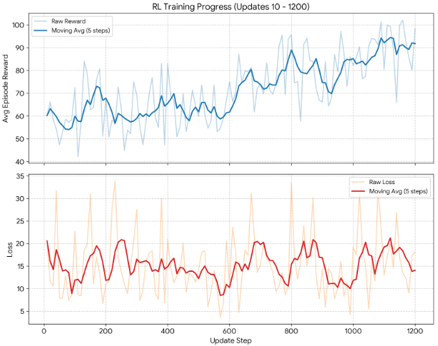
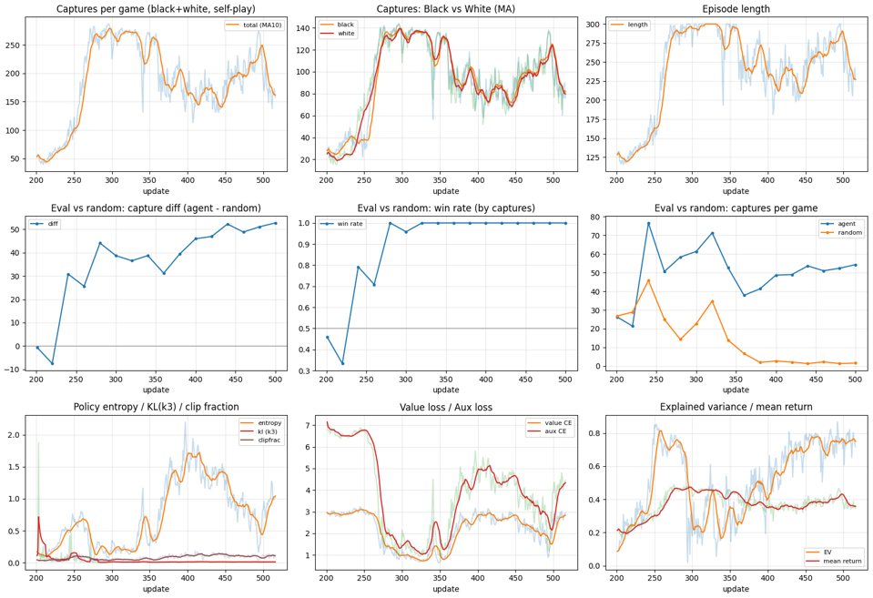
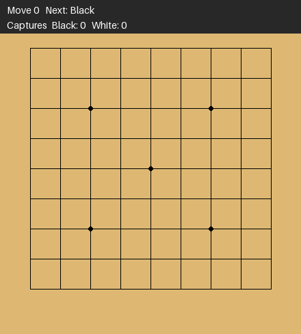

碁の強化学習をC++での続きの話です。
[前回はPython上で碁の環境と強化学習のアルゴリズムを構築](https://yoshishinnze.hatenablog.com/entry/2026/11/01/043000)しました。

前回組んだモデルはあまり学習が進みそうな気配ではなく、作ったとしてもランダムに比べて強い！と感じることが難しそうな状況でした。
せめて、"おっ！考えてる！？"と思う程度のエージェントにはしたいということでモデルをもう少し改善しようと思います。

## 本日目標

前回の碁のエージェントはCNNベース(Resnet)でした。
ですが、この手のエージェントはTransformerにすることで性能のベースラインが向上します。
PPO自体は実績のあるアルゴリズムです。
ネットワークにもう少し手を加えることで先週よりは学習がよりよく進むのではと考えています。

因みに前回の学習曲線はこんな感じです。
学習自体は進んでいるのですが、伸びが緩やかで、今後そこまで上昇するかに疑問、という感じでした。



## モデル変更の方針

この手の問題で既に[CNNに比べて優位性があることを確認しているRoPE付きのTransformer](https://yoshishinnze.hatenablog.com/entry/2026/07/25/043000)でモデル構築しようと思います。
勿論エージェントのアーキテクチャだけではないのですが、過去の実験からベースとなるアーキテクチャがそれなりだと、他を良くしてもそれなりというという傾向であることによります。

## モデル構築のキーポイント

主要な工夫は、ネットワーク設計と学習ループの二つに分かれます。
工夫点について説明していきます。

### ネットワーク側

**1. 2D RoPE を盤面トークンだけに適用**
今回Transformerでは位置エンコーダをRoPEとしますが、実装少しイレギュラーをします。
head_dim の前半を行、後半を列の回転に割り当てています(axial RoPE)。レジスタトークンは盤上の位置を持たないため、回転をかけません。

**2. RoPE が失う「盤端」の情報を別経路で補完**
RoPE は相対位置しか表せず、囲碁で重要な「端にあって呼吸点が少ない」という情報が落ちます。そこで次の2つを入れています。
- 盤端距離のプレーン(0, 1, 2, 3以上の one-hot)をネット内で自動付与します。
- Conv stem の zero padding でも端を検知します。

**3. Conv stem で局所パターンを先に拾う**
接続や呼吸点のような局所構造は、Attention 単体より Conv の方が得意です。そのため、Transformer の前に Conv を置いています。

**4. レジスタトークンによるグローバル情報の集約**
value 用の情報を集める専用トークンです。盤面トークンの平均プーリングと併用しています。

**5. 学習安定化のための部品**
Pre-Norm(RMSNorm)、QK-Norm、SwiGLU、`scaled_dot_product_attention` を採用しています。

**6. 相手の手を踏まえるための2手読みヘッド**
自分の着手 `a` の位置にマーカーを足し、追加ブロックを通して、着手後の相手の応手分布と局面の value を予測します。探索時に trunk を1回だけ計算し、候補手ごとにこのヘッドだけ回せるようにします。

**7. value を分布で出力**
捕獲差を61〜81ビンの分類にして、two-hot の CE で学習します。MSE より安定しやすく、期待値も同時に取れます。

**8. サイズ変更と後からの積層**
`GoNetConfig` と `small` / `base` / `large` のプリセットでサイズを切り替えられます。`grow()` で学習済みモデルにブロックを積み増せます。恒等初期化なら関数を変えずに積めます。

### 学習側

**1. 零和の GAE**
観測は常に手番側視点なので、次状態の価値は相手視点です。そのため `delta = r - γV' - V` のように符号を反転しています。これを入れないと、双方の捕獲数の合計を最大化する協調ゲームになってしまいます。

**2. 対称拡張と PPO の整合**
RoPE は回転・反転に不変ではないため、拡張後の盤面で `old_log_probs` と `old_values` を再計算しています。拡張はGPU上で置換テーブルを `gather` するだけの高速な実装です。

**3. 自己対戦のバッチ推論**
16局を並列に進め、1手ごとに全局をまとめて1回 forward します。Transformer を1手ずつ推論するより、はるかに高速です。

**4. 補助損失の教師を自己対戦データから作る**
応手ヘッドの教師は「次の手番で実際に打たれた手」、着手後 value の教師は「次状態の return」です。追加の環境計算なしで作れます。拡張時は次の手にも同じ変換をかけています。

**5. PPO の安定化**
- 学習率は 1e-4 に下げ、ウォームアップとコサイン減衰を入れました。
- KL が閾値を超えたらエポックを打ち切ります。
- エントロピー係数は徐々に下げます。
- clip率や explained variance もログに出します。

### 既知の弱点

- 3ch の観測には残りステップ数がなく、300手打ち切りの扱いが不安定になり得ます。
- `capture_map` ヘッドは、まだ教師を作っておらず未学習です。
- `get_legal_actions()` はPythonループなので、次のボトルネックになります。
- 対称拡張後の ratio は、厳密には近似です。

### 実際の実装

ネットワークはこんな感じに変えました。
学習ループは基本は合うように変えましたが、報酬計算にミスがあったため修正をしています。

```python
"""
9x9 囲碁用ネットワーク: 2D RoPE Transformer + 相手応手(2手読み)ヘッド

構成
----
入力 (B, C, N, N)
  + 盤端距離プレーン(ネット内で自動付与)
  → Conv stem (局所パターン / zero padding による端検知)
  → 1x1 Conv で d_model へ射影 → 盤面トークン N*N
  → [レジスタトークン R個] + 盤面トークン
  → [Pre-Norm → 2D RoPE Self-Attention → Pre-Norm → SwiGLU] × n_layers   (trunk)
  → heads
       policy        : 自分の着手分布 (N*N)
       value         : 捕獲差の分布 (value_bins) と期待値
       capture_map   : 「自分の石 / 相手の石が近く取られるか」の補助マップ
       lookahead     : 自分の着手 a を条件に
                         - 相手の応手分布 (N*N)
                         - 着手後の value (相手視点)
                       を予測 (軽量な追加ブロック数枚)

推奨入力プレーン (in_channels のデフォルト = 17)
------------------------------------------------
  0  自分の石
  1  相手の石
  2  手番が黒か (定数)
  3-5   自分の群の呼吸点  1 / 2 / 3以上
  6-8   相手の群の呼吸点  1 / 2 / 3以上
  9  自殺手を除いた合法手 (GoEnvFixed.get_legal_actions)
  10 置くと相手を取れる手
  11-14 直前4手の着手位置 (新しい順。相手・自分交互)
  15 step_count / 300 (定数)
  16 (自分のアゲハマ - 相手のアゲハマ) / 20 (定数)
※ in_channels はコンストラクタで変更可能。プレーン生成は別途用意してください。

使い方
------
    net = GoNet(GoNetConfig.base())              # プリセット
    net = GoNet(GoNetConfig(d_model=192, n_layers=8, n_heads=6))   # 自由指定
    out = net(x, legal_mask=mask, action=a)      # action を渡すと lookahead 出力も得る

ブロックの積層 (学習後・学習途中に深さを増やせる)
------------------------------------------------
    new_params = net.grow(2)                         # 最上段に恒等初期化のブロックを2枚積む
    new_params = net.grow(2, where="middle", mode="copy")   # 中央に既存ブロックのコピーを挿入
    net.grow(1, target="lookahead")                  # 2手読みヘッドのブロックを増やす
    optimizer.add_param_group({"params": new_params})        # 新パラメータを optimizer に登録
    net.freeze_blocks(range(8))                      # 下位8ブロックを凍結 (段階学習用)
    net.save("ckpt.pt"); net = GoNet.load("ckpt.pt")        # 深さ込みで保存/復元
"""

from __future__ import annotations

from dataclasses import dataclass, asdict, replace
from typing import Dict, Optional

import torch
import torch.nn as nn
import torch.nn.functional as F


# --------------------------------------------------------------------------
# 設定
# --------------------------------------------------------------------------
@dataclass
class GoNetConfig:
    board_size: int = 9
    in_channels: int = 17

    # ---- ネットワークサイズ (ここを変えるだけでスケール可能) ----
    d_model: int = 128
    n_layers: int = 6
    n_heads: int = 4
    ffn_mult: float = 4.0          # SwiGLU 隠れ次元の基準倍率 (実際は 2/3 倍して8の倍数に丸め)
    n_registers: int = 4           # グローバル情報用レジスタトークン数
    stem_channels: int = 64        # Conv stem のチャネル数
    stem_layers: int = 2           # Conv stem の層数

    # ---- 2手読みヘッド ----
    lookahead_layers: int = 2      # 着手条件付きの追加ブロック数 (0で無効)

    # ---- value ----
    value_bins: int = 61           # 捕獲差の分類ビン数 (奇数推奨)
    value_range: float = 30.0      # 捕獲差を [-range, +range] にクリップして離散化

    # ---- 正則化 / RoPE ----
    dropout: float = 0.0
    rope_base: float = 100.0

    def __post_init__(self):
        assert self.d_model % self.n_heads == 0, "d_model は n_heads で割り切れる必要があります"
        hd = self.d_model // self.n_heads
        assert hd % 4 == 0, f"head_dim={hd} は 4 の倍数にしてください (行/列で半分ずつ、さらにペア回転)"

    @property
    def head_dim(self) -> int:
        return self.d_model // self.n_heads

    # ---- プリセット ----
    @classmethod
    def small(cls, **kw):   # 約 1.2M params: 動作確認・高速実験用
        return cls(**{**dict(d_model=128, n_layers=6, n_heads=4, lookahead_layers=1), **kw})

    @classmethod
    def base(cls, **kw):    # 約 3M params
        return cls(**{**dict(d_model=192, n_layers=8, n_heads=6, lookahead_layers=2), **kw})

    @classmethod
    def large(cls, **kw):   # 約 9M params
        return cls(**{**dict(d_model=256, n_layers=12, n_heads=8, lookahead_layers=2,
                             stem_channels=96), **kw})


# --------------------------------------------------------------------------
# 2D RoPE (axial: head_dim の前半=行, 後半=列)
# --------------------------------------------------------------------------
class RoPE2D(nn.Module):
    def __init__(self, board_size: int, head_dim: int, base: float = 100.0):
        super().__init__()
        d = head_dim // 2                                   # 1軸あたりの次元
        inv = 1.0 / (base ** (torch.arange(0, d, 2).float() / d))   # (d/2,)
        ys, xs = torch.meshgrid(torch.arange(board_size), torch.arange(board_size), indexing="ij")
        ang = torch.cat([ys.reshape(-1, 1) * inv, xs.reshape(-1, 1) * inv], dim=-1)  # (HW, hd/2)
        self.register_buffer("cos", ang.cos(), persistent=False)
        self.register_buffer("sin", ang.sin(), persistent=False)

    def forward(self, x: torch.Tensor) -> torch.Tensor:
        """x: (B, heads, HW, head_dim) -> 同形状"""
        x1, x2 = x[..., 0::2], x[..., 1::2]
        cos = self.cos.to(x.dtype)
        sin = self.sin.to(x.dtype)
        out = torch.stack([x1 * cos - x2 * sin, x1 * sin + x2 * cos], dim=-1)
        return out.flatten(-2)


# --------------------------------------------------------------------------
# Transformer ブロック
# --------------------------------------------------------------------------
class RMSNorm(nn.Module):
    def __init__(self, dim: int, eps: float = 1e-6):
        super().__init__()
        self.eps = eps
        self.weight = nn.Parameter(torch.ones(dim))

    def forward(self, x):
        return x * torch.rsqrt(x.pow(2).mean(-1, keepdim=True) + self.eps) * self.weight


class RoPEAttention(nn.Module):
    """レジスタ(先頭 n_reg トークン)には RoPE をかけず、盤面トークンにのみ適用する"""

    def __init__(self, cfg: GoNetConfig, rope: RoPE2D):
        super().__init__()
        self.h = cfg.n_heads
        self.hd = cfg.head_dim
        self.n_reg = cfg.n_registers
        self.qkv = nn.Linear(cfg.d_model, 3 * cfg.d_model, bias=False)
        self.proj = nn.Linear(cfg.d_model, cfg.d_model, bias=False)
        self.q_norm = RMSNorm(self.hd)       # QK-Norm: 学習安定化
        self.k_norm = RMSNorm(self.hd)
        self.rope = rope
        self.drop = cfg.dropout

    def forward(self, x):                                   # x: (B, T, D), T = R + HW
        B, T, D = x.shape
        q, k, v = self.qkv(x).view(B, T, 3, self.h, self.hd).permute(2, 0, 3, 1, 4)
        q, k = self.q_norm(q), self.k_norm(k)
        R = self.n_reg
        if R > 0:
            q = torch.cat([q[:, :, :R], self.rope(q[:, :, R:])], dim=2)
            k = torch.cat([k[:, :, :R], self.rope(k[:, :, R:])], dim=2)
        else:
            q, k = self.rope(q), self.rope(k)
        o = F.scaled_dot_product_attention(q, k, v, dropout_p=self.drop if self.training else 0.0)
        return self.proj(o.transpose(1, 2).reshape(B, T, D))


class SwiGLU(nn.Module):
    def __init__(self, dim: int, mult: float, dropout: float = 0.0):
        super().__init__()
        hidden = int(dim * mult * 2 / 3)
        hidden = (hidden + 7) // 8 * 8
        self.w12 = nn.Linear(dim, 2 * hidden, bias=False)
        self.w3 = nn.Linear(hidden, dim, bias=False)
        self.drop = nn.Dropout(dropout)

    def forward(self, x):
        a, b = self.w12(x).chunk(2, dim=-1)
        return self.w3(self.drop(F.silu(a) * b))


class Block(nn.Module):
    def __init__(self, cfg: GoNetConfig, rope: RoPE2D):
        super().__init__()
        self.n1 = RMSNorm(cfg.d_model)
        self.attn = RoPEAttention(cfg, rope)
        self.n2 = RMSNorm(cfg.d_model)
        self.ffn = SwiGLU(cfg.d_model, cfg.ffn_mult, cfg.dropout)

    def forward(self, x):
        x = x + self.attn(self.n1(x))
        x = x + self.ffn(self.n2(x))
        return x


# --------------------------------------------------------------------------
# ヘッド
# --------------------------------------------------------------------------
class CellHead(nn.Module):
    """盤面トークン -> セルごとの logit (out_ch チャネル)"""

    def __init__(self, d: int, out_ch: int = 1):
        super().__init__()
        self.norm = RMSNorm(d)
        self.fc1 = nn.Linear(d, d)
        self.fc2 = nn.Linear(d, out_ch)

    def forward(self, h):                                   # (B, HW, D) -> (B, HW, out_ch)
        return self.fc2(F.gelu(self.fc1(self.norm(h))))


class ValueHead(nn.Module):
    """レジスタ + 盤面平均プーリング -> MLP -> 捕獲差の分布 logits"""

    def __init__(self, cfg: GoNetConfig):
        super().__init__()
        d = cfg.d_model
        self.n_reg = cfg.n_registers
        self.norm = RMSNorm(d)
        in_dim = d * (2 if cfg.n_registers > 0 else 1)
        self.mlp = nn.Sequential(nn.Linear(in_dim, d), nn.GELU(), nn.Linear(d, cfg.value_bins))

    def forward(self, tokens):                              # (B, R+HW, D)
        t = self.norm(tokens)
        R = self.n_reg
        pooled = t[:, R:].mean(1)
        feat = torch.cat([t[:, :R].mean(1), pooled], -1) if R > 0 else pooled
        return self.mlp(feat)


# --------------------------------------------------------------------------
# 本体
# --------------------------------------------------------------------------
class GoNet(nn.Module):
    def __init__(self, cfg: Optional[GoNetConfig] = None, **kwargs):
        """GoNet(GoNetConfig(...)) でも GoNet(d_model=192, n_layers=8) でも可"""
        super().__init__()
        if cfg is None:
            cfg = GoNetConfig(**kwargs)
        elif kwargs:
            cfg = GoNetConfig(**{**asdict(cfg), **kwargs})
        self.cfg = cfg
        N, D = cfg.board_size, cfg.d_model
        self.N, self.HW = N, N * N

        # 盤端距離プレーン (min(行,列,N-1-行,N-1-列) の one-hot: 0,1,2,3以上)
        ys, xs = torch.meshgrid(torch.arange(N), torch.arange(N), indexing="ij")
        dist = torch.minimum(torch.minimum(ys, xs), torch.minimum(N - 1 - ys, N - 1 - xs)).clamp(max=3)
        edge = F.one_hot(dist, 4).permute(2, 0, 1).float()  # (4, N, N)
        self.register_buffer("edge_planes", edge, persistent=False)

        # Conv stem
        c_in, c = cfg.in_channels + 4, cfg.stem_channels
        layers = []
        for i in range(cfg.stem_layers):
            layers += [nn.Conv2d(c_in if i == 0 else c, c, 3, padding=1), nn.GELU()]
        self.stem = nn.Sequential(*layers)
        self.to_tokens = nn.Conv2d(c if cfg.stem_layers > 0 else c_in, D, 1)

        # レジスタ
        self.registers = nn.Parameter(torch.randn(cfg.n_registers, D) * 0.02) if cfg.n_registers > 0 else None

        # Trunk
        self.rope = RoPE2D(N, cfg.head_dim, cfg.rope_base)
        self.blocks = nn.ModuleList([Block(cfg, self.rope) for _ in range(cfg.n_layers)])

        # Heads
        self.policy_head = CellHead(D, 1)
        self.value_head = ValueHead(cfg)
        self.capture_head = CellHead(D, 2)                  # ch0: 自分の石が取られる / ch1: 相手の石が取られる

        # 2手読みヘッド: 自分の着手 a を条件に 相手応手 + 着手後value を予測
        if cfg.lookahead_layers > 0:
            self.move_embed = nn.Parameter(torch.randn(D) * 0.02)       # 着手位置トークンに足すマーカー
            self.la_blocks = nn.ModuleList([Block(cfg, self.rope) for _ in range(cfg.lookahead_layers)])
            self.reply_head = CellHead(D, 1)
            self.la_value_head = ValueHead(cfg)

        # value のサポート (ビン中心)
        support = torch.linspace(-cfg.value_range, cfg.value_range, cfg.value_bins)
        self.register_buffer("value_support", support, persistent=False)

        self.apply(self._init)

    @staticmethod
    def _init(m):
        if isinstance(m, nn.Linear):
            nn.init.trunc_normal_(m.weight, std=0.02)
            if m.bias is not None:
                nn.init.zeros_(m.bias)

    # ---------------- ブロックの積層 (深さの拡張) ----------------
    def _new_block(self, mode: str, src: Optional[Block] = None) -> Block:
        """mode: 'identity' = 残差出力をゼロ初期化 (積んでも関数が変わらない)
                 'copy'     = src の重みをコピー (progressive stacking)
                 'random'   = 通常の初期化"""
        assert mode in ("identity", "copy", "random")
        blk = Block(self.cfg, self.rope)                    # RoPE キャッシュは全ブロックで共有
        if mode == "copy":
            assert src is not None, "copy には複製元ブロックが必要です"
            blk.load_state_dict(src.state_dict())
        else:
            blk.apply(self._init)
            if mode == "identity":
                nn.init.zeros_(blk.attn.proj.weight)
                nn.init.zeros_(blk.ffn.w3.weight)
        return blk.to(device=next(self.parameters()).device)

    @torch.no_grad()
    def grow(self, n_new: int = 1, where="top", mode: str = "identity", target: str = "trunk"):
        """
        Transformer ブロックを n_new 枚積み増す。cfg の n_layers / lookahead_layers も更新される。

        where : 'top' (最上段) / 'bottom' (最下段) / 'middle' / 整数 (挿入位置のインデックス)
        mode  : 'identity' | 'copy' | 'random'  (_new_block 参照)
        target: 'trunk' (メイン) / 'lookahead' (2手読みヘッド側)
        戻り値 : 新規パラメータのリスト (optimizer.add_param_group に渡す)
        """
        if target == "trunk":
            blocks = self.blocks
        elif target == "lookahead":
            assert self.cfg.lookahead_layers > 0, "lookahead_layers=0 のモデルには追加できません"
            blocks = self.la_blocks
        else:
            raise ValueError(target)

        L = len(blocks)
        pos = {"top": L, "bottom": 0, "middle": L // 2}.get(where, where) if isinstance(where, str) else int(where)
        assert 0 <= pos <= L, f"where={where} は 0..{L} の範囲で指定してください"

        new_blocks = []
        for _ in range(n_new):
            src = blocks[min(max(pos - 1, 0), L - 1)] if L > 0 else None   # 直下(なければ先頭)のブロック
            new_blocks.append(self._new_block(mode, src))

        merged = list(blocks)
        merged[pos:pos] = new_blocks
        merged = nn.ModuleList(merged)
        if target == "trunk":
            self.blocks = merged
            self.cfg = replace(self.cfg, n_layers=len(merged))
        else:
            self.la_blocks = merged
            self.cfg = replace(self.cfg, lookahead_layers=len(merged))
        return [p for b in new_blocks for p in b.parameters()]

    def freeze_blocks(self, indices=None, freeze: bool = True, target: str = "trunk"):
        """指定インデックスのブロックを凍結 / 解除 (indices=None で全ブロック)"""
        blocks = self.blocks if target == "trunk" else self.la_blocks
        idx = range(len(blocks)) if indices is None else indices
        for i in idx:
            for p in blocks[i].parameters():
                p.requires_grad_(not freeze)

    # ---------------- 保存 / 復元 (深さ込み) ----------------
    def save(self, path: str):
        torch.save({"cfg": asdict(self.cfg), "state": self.state_dict()}, path)

    @classmethod
    def load(cls, path: str, map_location="cpu") -> "GoNet":
        ck = torch.load(path, map_location=map_location)
        net = cls(GoNetConfig(**ck["cfg"]))
        net.load_state_dict(ck["state"])
        return net

    # ---------------- trunk ----------------
    def encode(self, x: torch.Tensor) -> torch.Tensor:
        """x: (B, C, N, N) -> tokens (B, R+HW, D)"""
        B = x.shape[0]
        x = torch.cat([x, self.edge_planes.unsqueeze(0).expand(B, -1, -1, -1).to(x.dtype)], dim=1)
        x = self.stem(x)
        t = self.to_tokens(x).flatten(2).transpose(1, 2)    # (B, HW, D)
        if self.registers is not None:
            t = torch.cat([self.registers.unsqueeze(0).expand(B, -1, -1), t], dim=1)
        for blk in self.blocks:
            t = blk(t)
        return t

    def value_from_logits(self, logits: torch.Tensor) -> torch.Tensor:
        return (logits.softmax(-1) * self.value_support).sum(-1)

    # ---------------- 2手読み ----------------
    def lookahead(self, tokens: torch.Tensor, action: torch.Tensor) -> Dict[str, torch.Tensor]:
        """
        tokens: encode() の出力 (B, R+HW, D)
        action: (B,) 自分の着手 (0..N*N-1)
        戻り値:
          opp_reply_logits : (B, N*N) 着手後の相手の応手分布 (マスクなし。損失側で合法手を考慮)
          la_value_logits  : (B, value_bins) 着手後局面の捕獲差分布 (※相手視点)
          la_value         : (B,) その期待値 (相手視点。自分視点にするには符号反転)
        探索中は encode() を1回だけ行い、複数の action に対して本関数を呼ぶと効率的。
        """
        assert self.cfg.lookahead_layers > 0, "lookahead_layers=0 のため無効です"
        R = self.cfg.n_registers
        idx = (action + R).view(-1, 1, 1).expand(-1, 1, tokens.size(-1))
        marker = torch.zeros_like(tokens).scatter(1, idx, self.move_embed.view(1, 1, -1).expand(tokens.size(0), 1, -1).to(tokens.dtype))
        t = tokens + marker
        for blk in self.la_blocks:
            t = blk(t)
        logits = self.la_value_head(t)
        return {
            "opp_reply_logits": self.reply_head(t[:, R:]).squeeze(-1),
            "la_value_logits": logits,
            "la_value": self.value_from_logits(logits),
        }

    # ---------------- forward ----------------
    def forward(
        self,
        x: torch.Tensor,
        legal_mask: Optional[torch.Tensor] = None,
        action: Optional[torch.Tensor] = None,
    ) -> Dict[str, torch.Tensor]:
        """
        x          : (B, C, N, N)
        legal_mask : (B, N*N) bool。与えると policy_logits の非合法手が -inf 相当になる
        action     : (B,) 実際に打った手。与えると lookahead 出力も計算する
                     (学習時は self-play で実際に打たれた手を渡す)
        """
        tokens = self.encode(x)
        R = self.cfg.n_registers
        board = tokens[:, R:]

        policy_logits = self.policy_head(board).squeeze(-1)             # (B, HW)
        if legal_mask is not None:
            policy_logits = policy_logits.masked_fill(~legal_mask, torch.finfo(policy_logits.dtype).min)

        value_logits = self.value_head(tokens)
        out = {
            "policy_logits": policy_logits,
            "value_logits": value_logits,
            "value": self.value_from_logits(value_logits),
            "capture_map_logits": self.capture_head(board).transpose(1, 2).reshape(-1, 2, self.N, self.N),
        }
        if action is not None and self.cfg.lookahead_layers > 0:
            out.update(self.lookahead(tokens, action))
        return out

    # ---------------- 補助: value 教師の離散化 ----------------
    def value_to_target(self, v: torch.Tensor) -> torch.Tensor:
        """スカラー捕獲差 (B,) -> two-hot 分布 (B, value_bins)。value_logits との CE 用"""
        cfg = self.cfg
        v = v.clamp(-cfg.value_range, cfg.value_range)
        pos = (v + cfg.value_range) / (2 * cfg.value_range) * (cfg.value_bins - 1)
        lo = pos.floor().long().clamp(0, cfg.value_bins - 1)
        hi = (lo + 1).clamp(max=cfg.value_bins - 1)
        w_hi = pos - lo.float()
        tgt = torch.zeros(v.size(0), cfg.value_bins, device=v.device, dtype=v.dtype)
        tgt.scatter_add_(1, lo.unsqueeze(1), (1 - w_hi).unsqueeze(1))
        tgt.scatter_add_(1, hi.unsqueeze(1), w_hi.unsqueeze(1))
        return tgt


def count_params(m: nn.Module) -> int:
    return sum(p.numel() for p in m.parameters())


if __name__ == "__main__":
    for name in ["small", "base", "large"]:
        net = GoNet(getattr(GoNetConfig, name)())
        x = torch.randn(2, net.cfg.in_channels, 9, 9)
        mask = torch.ones(2, 81, dtype=torch.bool)
        a = torch.tensor([0, 40])
        out = net(x, legal_mask=mask, action=a)
        loss = out["policy_logits"].float().logsumexp(-1).mean() + out["opp_reply_logits"].mean() + out["la_value"].mean()
        loss.backward()
        print(f"{name:6s} params={count_params(net)/1e6:.2f}M",
              {k: tuple(v.shape) for k, v in out.items()})

    # 積層テスト: identity 初期化なら、ブロックを積んでも出力が変わらない
    net = GoNet(GoNetConfig.small()).eval()
    x = torch.randn(2, net.cfg.in_channels, 9, 9)
    with torch.no_grad():
        before = net(x)["policy_logits"]
    new_params = net.grow(2, where="middle", mode="identity")
    net.grow(1, target="lookahead")
    with torch.no_grad():
        after = net(x)["policy_logits"]
    print("layers:", net.cfg.n_layers, len(net.blocks),
          "| new params:", len(new_params),
          "| max diff after identity grow:", (before - after).abs().max().item())
```

### 実装コード

学習ループは以下に保存しているものをご参考下さい。

https://github.com/Shinichi0713/Reinforce-Learning-Study/tree/main/physical_engine/chess/python


## 学習の結果

### 学習進捗

学習の結果はこんな感じとなりました。
`win rate` や `capture diff` から回数が伸びるごとにエージェント VS ランダムでエージェントが有利になっていくことが確認出来ました。




### agentの動作

白が今回構築したエージェントです。
圧倒的というかはおいておいて、有利に勝負を進めることが確認出来ました。



## 総括

今回の実験で分かったことは以下の通りです。

**アーキテクチャの変更が有効だった。** CNN（ResNet）から2D RoPE付きTransformerへ移行したことで、前回よりも学習が進み、ランダム相手に対する勝率と捕獲差が改善しました。Transformerの自己注意機構が、碁盤の広域的な依存関係（石の接続や勢力関係）を捉えるのに適していたと考えられます。

**盤面特有の工夫が重要だった。** 純粋なTransformerでは失われやすい「盤端の情報」を、盤端距離のone-hotプレーンとConv stemのzero paddingで補完したこと、また接続や呼吸点といった局所パターンをConv stemで先に抽出したことが、学習の安定化に寄与しました。

**学習ループの設計が勝率に直結した。** 零和ゲームとしてのGAE（手番側視点での符号反転）、対称拡張に合わせたold_log_probsの再計算、自己対戦のバッチ推論による効率化、2手読みヘッドによる補助損失、value分布化など、PPO周辺の工夫が総合的に機能し、前回の緩やかな学習曲線から脱却して、明確にランダムを圧倒するエージェントが作れました。

**結論として、碁の9路盤においては「Transformerベースの表現力」＋「盤面構造を考慮した入力設計」＋「零和性を正しく扱ったPPO」の組み合わせが、弱いベースラインから「考えているように見える」エージェントへの到達に必要だった**ということです。

