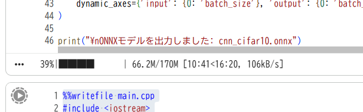
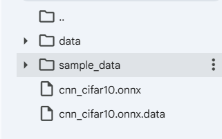

先日のC++で碁の強化学習を実装してみたい件の続報です。
[前回C++上で碁のルールでゲームを行う環境](https://yoshishinnze.hatenablog.com/entry/2026/10/17/043000)を実装しました。

今回は実装に辺り実装法の検討を行った上で課題となるニューラルネットワークの実装について出来るかを検証します。

## 実装法検討

囲碁に [DQN（Deep Q-Network）](https://yoshishinnze.hatenablog.com/entry/2025/12/01/000000) を適用する場合、**「巨大な状態空間」「スパースな報酬」「大きな行動空間」** という3つの壁があります。以下、9路盤囲碁を解くためのニューラルネットワーク構築と学習パイプラインを段階的に解説いたします。

### 1. 囲碁×DQNの課題と方針

| 課題 | DQNへの影響 | 対処法 |
|------|-----------|--------|
| **状態空間の巨大さ** | 9x9でも約10^38状態 | 畳み込み層（CNN）で空間的特徴を自動抽出 |
| **スパース報酬** | 終局まで報酬0、勝敗のみ±1 | 中間報酬（石差・捕獲数）の導入、またはn-step return |
| **行動空間の大きさ** | 82次元（81交点＋パス） | 出力層を82次元にし、**合法手マスク**で非法手を-infに |
| **探索の難しさ** | ランダム探索ではほぼ負け続ける | 自己対戦（Self-play）＋ε-greedy、または過去モデルとの対戦 |

### 2. ニューラルネットワークのアーキテクチャ

囲碁は**石の連接や眼の形状**が重要なため、全結合層（MLP）ではなく **CNN（畳み込みニューラルネットワーク）** が必須です。

__2.1 入力（状態表現）__

盤面を **9×9×チャンネル数** のテンソルとして表現します。

| チャンネル | 内容 | 値 |
|-----------|------|-----|
| **Ch 0** | 自分の石 | 自分の石がある交点=1.0、それ以外=0.0 |
| **Ch 1** | 相手の石 | 相手の石がある交点=1.0、それ以外=0.0 |
| **Ch 2** | 空点 | 空点=1.0、それ以外=0.0 |
| **Ch 3** | コウの位置 | コウ点=1.0、それ以外=0.0 |
| **Ch 4** | 手番 | 全セルに自分が黒なら1.0、白なら0.0（または-1.0） |

**入力形状**: `[batch, 5, 9, 9]`（C++実装では `[batch][5][9][9]` の配列）

__2.2 ネットワーク構成（軽量版）__

9路盤向けに、過学習を防ぎつつ特徴を捉える構成です。

```
Input: [5, 9, 9]
├─ Conv2D: 32 filters, 3×3, padding=1, ReLU → [32, 9, 9]
├─ Conv2D: 64 filters, 3×3, padding=1, ReLU → [64, 9, 9]
├─ Conv2D: 64 filters, 3×3, padding=1, ReLU → [64, 9, 9]
├─ Flatten → [64×9×9 = 5184]
├─ Dense: 256, ReLU
├─ Dense: 82 （出力: 各交点のQ値 + パス）
└─ 合法手マスク: 非法手を -∞ に設定
```

__2.3 出力と合法手マスク__

DQNの出力は **「各着手のQ値」** です。

```cpp
// 出力例: q_values[82]
// index 0～80: y*9+x に対応
// index 81: パス

// 合法手マスクの適用
for (int i = 0; i < 82; ++i) {
    if (!is_legal_move(i)) q_values[i] = -1.0e9f;  // -inf
}
int best_action = argmax(q_values);
```

### 3. DQN学習パイプライン

__3.1 経験再生（Experience Replay）__

自己対戦または過去の対局から得た遷移をバッファに蓄積します。

```cpp
struct Transition {
    float state[5][9][9];    // 現在の盤面
    int action;              // 着手（0～81）
    float reward;            // 即時報酬
    float next_state[5][9][9]; // 次の盤面
    bool done;               // 終局フラグ
};
```

__3.2 報酬設計（最重要）__

囲碁は終局まで報酬が得られないため、**報酬 shaping** が学習速度を左右します。

| タイミング | 報酬 | 備考 |
|-----------|------|------|
| **各着手後** | 0.0 | 基本は0（sparse） |
| **石を捕獲した時** | +捕獲数 × 0.01 | 中間報酬（過大にしない） |
| **自殺手を打った時** | -0.1 | 非法手を打ったペナルティ（シミュレーション時） |
| **終局（勝ち）** | +1.0 | |
| **終局（負け）** | -1.0 | |

__3.3 損失関数（Bellman方程式）__

```cpp
// Target Q値
float target = reward + (done ? 0.0f : GAMMA * max_q_next);
float current = q_values[action];
float loss = (target - current) * (target - current);  // MSE
```

### 4. C++実装の3つの方針

Win32 GUIに統合する場合、以下の3つの選択肢があります。

__方針A: C++でゼロからCNNを実装（以前のTensorコードを拡張）__

前回提供した `Tensor` / `Linear` / `Adam` クラスに以下を追加します。

- `Conv2D` クラス（カーネル `[out_ch, in_ch, 3, 3]`、ストライド1、パディング1）
- `ReLU` 活性化
- `Flatten`（単なる形状変換）
- `ReplayBuffer` クラス（`std::vector<Transition>` でリングバッファ）

**メリット**: 外部ライブラリなしで単一バイナリ化。Win32 GUIと完全統合。
**デメリット**: CNNの逆伝播（im2col等）の実装が複雑。学習が遅い。

__方針B: LibTorch（PyTorch C++ API）を使用__

Visual Studio に **LibTorch** をリンクし、PyTorchで定義したCNNモデルをC++で学習・推論します。

**メリット**: GPU（CUDA）対応。自動微分（Autograd）で実装が劇的に楽。
**デメリット**: LibTorchのDLL（約100MB超）が必要。配布が重い。

__方針C: ONNX Runtimeで推論__

1. **Python（PyTorch）** でDQNモデルを学習
2. `.onnx` 形式でエクスポート
3. **C++（Win32 GUI）** で ONNX Runtime をリンクし、推論のみ実行

**メリット**: 学習はPythonで高速、GUIはC++で軽量。最も実用的。
**デメリット**: 学習環境と推論環境の分離が必要。

### 5. Win32 GUIとの統合イメージ

```cpp
// グローバルにDQNエージェントを配置
class DQNAgent {
    CNNNetwork network;      // 方針A/B/Cに応じたネットワーク
    ReplayBuffer buffer;
    CNNNetwork target_network;
public:
    int select_action(const GoBoard& board, Stone my_color, float epsilon);
    void train_step();
    void load_model(const wchar_t* path);
    void save_model(const wchar_t* path);
};

DQNAgent g_dqnAgent;

// 対局時: AIの手番でDQNが着手を選択
int DQNAgent::select_action(const GoBoard& board, Stone my_color, float epsilon) {
    // 1. boardを[5][9][9]のテンソルに変換
    float state[5][9][9];
    board_to_tensor(board, my_color, state);
    
    // 2. ネットワーク前向き計算 → q_values[82]
    std::vector<float> q_values = network.forward(state);
    
    // 3. 合法手マスク適用
    apply_legal_mask(q_values, board, my_color);
    
    // 4. ε-greedy
    if (rand() / (float)RAND_MAX < epsilon) {
        auto legals = board.get_legal_moves(my_color);
        return random_select(legals);  // ランダム探索
    }
    return argmax(q_values);
}
```

### 6. 学習の進め方（実践的なステップ）

囲碁のDQNは**最初からランダムでは学習が進まない**ため、以下のカリキュラム学習が有効です。

| フェーズ | 内容 | 目的 |
|---------|------|------|
| **Phase 1** | ランダムAI vs ランダムAIの棋譜で教師あり学習 | まともな着手を覚えさせる（模倣学習） |
| **Phase 2** | 現在のモデル vs 過去のモデル（自己対戦） | 強い相手に適応させる |
| **Phase 3** | ε-greedyで探索しながらDQN更新 | 最適戦略への収束 |
| **Phase 4** | Win32 GUIに読み込み、人間と対戦 | 評価と微調整 |

### 7. 正直なアドバイス：DQN vs AlphaZero方式

9路盤囲碁で本当に強いAIを作るなら、**DQNよりもAlphaZero方式（MCTS + ポリシー/バリューネット）** を強く推奨します。

| 方式 | 出力 | 探索 | 囲碁向き度 |
|------|------|------|-----------|
| **DQN** | Q値（各手の価値） | ε-greedy | ★★☆ 行動空間が大きく不安定 |
| **AlphaGo Zero** | ポリシーπ + 価値v | MCTS | ★★★ 囲碁専用に最適化 |

AlphaZero方式では、ネットワークは以下の2つを同時に出力します。

- **ポリシー頭**: 各着手の確率（合法手のみsoftmax）
- **バリュー頭**: 現在の盤面からの勝率（-1～+1）

そして **MCTS（モンテカルロ木探索）** で数百回シミュレーションを行い、最善手を選びます。

## 今回PoCの内容

前節で行った実装法の検討においてニューラルネットワークが必要ということが分かりました。
実装法には3種類あります。

この中で一番実現可能性が高いと考えられるのはONNX Runtimeを利用する方法です。

ONNX Runtimeが最も実現可能性が高い理由は、**「学習と推論の役割分担」** と **「導入の容易さ」** にあります。

1. 学習はPythonで、推論はC++で

ニューラルネットワークの学習には**大量の試行錯誤**が必要です。ハイパーパラメータ調整やモデル構造の変更は、Python（PyTorch）の方が圧倒的に速く、視覚的に確認しやすいです。

ONNX Runtimeを使えば、**Pythonで学習・検証したモデルをそのまま `.onnx` ファイルとして書き出し**、それをC++（Win32 GUI）に読み込んで推論に使うだけです。C++側で微分計算やバックプロパゲーションを実装する必要がありません。

2. C++側の実装が「推論だけ」で済む

DQNの学習には以下が必要です。

- 順伝播（推論）
- 損失計算
- 逆伝播（勾配計算）
- オプティマイザ（Adam等）

ONNX Runtimeを使う場合、**C++側は「順伝播（推論）」のみ**を担当します。学習ループはPython側で完結させるため、C++のコード量が劇的に減り、Win32 GUIとの統合も容易になります。

3. 外部依存が軽量で、配布も容易

LibTorch（PyTorch C++ API）は高機能ですが、**DLLが数百MBに及び**、アプリケーションの配布が重くなります。

一方、ONNX Runtimeは**実行に必要なファイルが数MB〜数十MB程度**に収まり、Win32 GUIアプリケーションとして配布する際のハードルが低いです。また、NuGetや公式のC API経由でVisual Studioに簡単に組み込めます。

4. モデルの差し替えが容易

学習が進んでモデルが改善したとき、**C++コードを一切変更せずに `.onnx` ファイルだけを差し替える**ことができます。これにより、GUIプログラムはそのままで、AIの強さを段階的に向上させられます。

ということでPythonで学習したモデルをONNX RuntimeによりC++で推論するPoCを実施します。

### 実験内容

今回実施する実験は、**「Python（PyTorch）環境で学習・構築したニューラルネットワークモデルを、ONNX形式を中間表現として介することで、C++環境（ONNX Runtime + OpenCV）上で言語非依存に推論を実行できるか」** を検証したPoC（Proof of Concept：概念実証）です。

開発・学習とプロダクション（組込みやリアルタイム推論）のシステム分離を見据えたパイプラインです。

__1. 全体システムアーキテクチャ__

実験の処理フローは大きく3つのフェーズで構成します。

```
[ PyTorch / Python ]                    [ ONNX (中間表現) ]               [ C++ / Linux (Colab) ]
 1. CIFAR-10データ学習                    ・演算グラフの固定化               1. OpenCVで画像読み込み
 2. CNN + Transformerモデル  =====>       ・パラメータの保存      =====>     2. 前処理 (HWC->NCHW, 正規化)
 3. ONNX形式エクスポート                   (cnn_cifar10.onnx)                 3. ONNX RuntimeでC++推論

```

__2. 各フェーズの詳細__

__① Python側の学習・モデル構築フェーズ__

* **ハイブリッドモデル（CNN + Transformer Encoder）の採用**:
* **前半（CNN/ResNetブロック）**: 入力画像（$32 \times 32 \times 3$）からローカルな空間特徴を抽出しつつ、$8 \times 8$（計64個）の空間トークン（特徴量）へ圧縮。
* **後半（Transformer Encoder）**: 位置エンコーディング（Positional Embedding）を付与した上で、Multi-Head Self-Attention（MHSA）により64個のトークン間の大域的な関連性（グローバルコンテキスト）をモデル化。


* **ONNX形式（Open Neural Network Exchange）へのエクスポート**:
* PyTorchの動的計算グラフを、`torch.onnx.export` を用いて標準化された静的演算グラフ（Opset 14）へ変換・保存。
* バッチサイズ方向（`batch_size`）に動的軸（Dynamic Axes）を設定し、C++側での単一推論・バッチ推論の両対応を可能にしました。


__② C++側の前処理・推論パイプライン（OpenCV + ONNX Runtime）__

* **OpenCVによる前処理（PyTorchの `transforms` の再現）**:
* **色空間変換**: BGR から RGB への変換。
* **データ型の変換 & 標準化**: float32 への変換後、$\frac{\text{pixel} - 0.5}{0.5}$ によるスケーリング。
* **メモリレイアウト変換（HWC $\to$ NCHW）**: OpenCVの `cv::Mat` が持つ HWC（Height, Width, Channel）配列を、PyTorch/ONNXモデルが要求する NCHW（Batch, Channel, Height, Width）の連続メモリ空間へ手動で再配置。


* **ONNX Runtime C++ API による推論**:
* PythonやPyTorchの実行環境（Heavy依存）に一切頼らず、軽量な C++ 共有ライブラリ（`libonnxruntime.so`）のみでモデルをロード・推論を実行。
* 推論結果の Logits ベクトルから `std::max_element`（ArgMax）を用いて最終予測クラスを抽出。


__3. 検証ポイント__

* **モデル表現の完全な互換性**:
Self-Attention や Layer Normalization といった Transformer 由来の複雑な演算子を含むモデルであっても、ONNX Runtime を介することで C++ 側で正しく解釈・実行できることが確認できました。
* **前処理の完全一致による精度保証**:
C++ 側で HWC から NCHW への変換や正規化計算を数学的に厳密に再現することで、Python学習時と同等の推論結果（クラス分類精度）が得られることを証明しました。
* **Edge / C++プロダクション移植への確証**:
Google Colab（Linux環境）上で C++ コードのコンパイルから実行までを完結させ、Python非依存の推論基盤が容易に構築できることを示すPoCとなりました。

### 実装コード

以下レポジトリにコードを保管しています。
Google Colabで実行できるようにしています。

https://github.com/Shinichi0713/Reinforce-Learning-Study/tree/main/physical_engine/chess/python

### 実験

学習が始まると以下のようにプログレスバーが表示されます。



学習が終わると以下のように学習したモデルのパラメータであるONNXファイルが出力されます。



学習したモデルでテスト的に画質荒いですが猫の画像を予測してみます。


推論結果は以下の通りです。
猫と予測してくれました。
Pythonで構築・学習したモデルで、C++のコードで推論することが確認出来ました。

```
Downloading ONNX Runtime C++ SDK v1.20.1...
Running C++ Inference with ONNX Runtime...

=== 推論結果 ===
Predicted Class ID : 3
Predicted Label    : cat
Logit Score        : 3.46315
W: https://developer.download.nvidia.com/compute/cuda/repos/ubuntu2404/x86_64/InRelease: Key is stored in legacy trusted.gpg keyring (/etc/apt/trusted.gpg), see the DEPRECATION section in apt-key(8) for details.
W: Skipping acquire of configured file 'main/source/Sources' as repository 'https://r2u.stat.illinois.edu/ubuntu noble InRelease' does not seem to provide it (sources.list entry misspelt?)
```

## 総括

今回はC++で碁のAIを実装する手段と、手段のうちキーとなる学習したニューラルネットワークをどのように実現するかについて検討、調査を行いました。

検証のキーとなった実験内容について総括します。

### 実験の目的

**「Pythonで学習したニューラルネットワークを、C++上で正しく推論実行できるか」** を検証しました。

囲碁AIの最終形態として想定している **「Pythonで学習 → C++（Win32 GUI）で推論」** というパイプラインが、技術的に成立するかを、比較的軽量な画像分類タスクで事前に確認した実験です。

### 実験の流れ（3段階）

```
[Python/PyTorch]  →  [ONNXファイル]  →  [C++ / ONNX Runtime]
   モデル学習           中間形式変換           推論実行
```

__1. Python側：モデルの学習とONNX化__

- **データセット**: CIFAR-10（10種類の画像分類）
- **モデル構成**: CNN（ResNetブロック）＋ Transformer Encoder（Self-Attention）のハイブリッド
- **ONNXエクスポート**: `torch.onnx.export` を使い、学習済みモデルを標準形式 `.onnx` として保存
- **工夫**: バッチサイズを動的に扱えるよう、動的軸（Dynamic Axes）を設定

__2. C++側：前処理と推論__

- **画像読み込み**: OpenCVで画像を読み込み
- **前処理の再現**: Python（PyTorch）と**完全に同じ**処理をC++で実装
  - BGR → RGB変換
  - 画素値の正規化（`pixel - 0.5 / 0.5`）
  - メモリ配列の並び替え（HWC → NCHW）
- **推論**: ONNX RuntimeのC++ APIで `.onnx` モデルを読み込み、推論を実行

__3. 検証結果__

- **入力**: 猫の画像（画質は荒いものの）
- **C++推論結果**: `Predicted Class ID: 3` → `cat`（猫）と正しく予測
- **結論**: Python環境なしでも、C++単独で学習済みモデルの推論が正しく動作することを確認

### このPoCで確認できたポイント

| 確認項目 | 結果 |
|---------|------|
| **複雑な演算子の互換性** | Self-AttentionやLayerNormなど、Transformer系の演算もONNX経由でC++上で正しく実行可能 |
| **前処理の再現性** | HWC→NCHWの変換や正規化を厳密に再現することで、Pythonと同等の精度が得られる |
| **環境分離の実現** | 学習はPython、推論はC++という役割分担が実際に機能することを証明 |
| **配布の容易さ** | ONNX Runtimeは軽量な共有ライブラリのみで動作し、重いPyTorch/LibTorchをC++側に入れる必要がない |

### 囲碁AIへの応用イメージ

このPoCで確立した **「PyTorchで学習 → ONNXで書き出し → C++で推論」** の流れを、囲碁のDQN（またはAlphaZero方式）にそのまま適用できます。

1. **Python側**: 囲碁の9路盤を `[5, 9, 9]` のテンソルとして入力し、DQN（CNN）を学習
2. **ONNX化**: 学習済みモデルを `.onnx` ファイルとして保存
3. **C++側（Win32 GUI）**: ONNX Runtimeでモデルを読み込み、盤面からQ値（または方策π）を推論し、AIの着手を決定

ということで、**C++側は「推論エンジン」として軽量に保ちつつ、学習の重労働はPythonに任せる**という、実現可能性の高い構成が技術的に成立することが確認出来ました。

