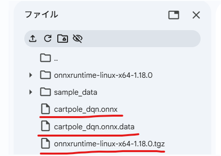
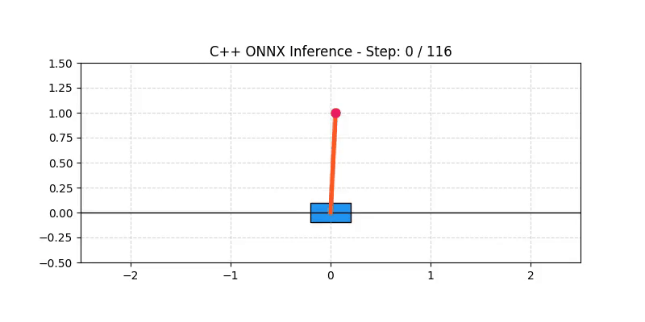

強化学習で学習したモデルを実際の機器に組み込む時、PCのようなリソースがリッチな環境ではない場合、どの様にしているのでしょうか。
サイズが小さいAIモデルであればラズパイで動作させることも可能ですが、当然操作が複雑になってくるとラズパイでは動作させることが難しくなってきます。
今日はそんな**リソースが限られた環境でAIを動作させるための方法**について説明していきます。

## C++で強化学習を使うメリット

Pythonが強化学習のデファクトスタンダードである現在でも、**C++で強化学習（および環境シミュレーション）を動かすメリットは明確かつ強力に存在します**。

結論から言うと、最大の理由は **「実行速度とリソース効率（特に大規模並列処理）」** であり、これが直接的に **「実験サイクルの高速化」や「製品化（組み込み・リアルタイム制御）」** に繋がるためです。

主なメリットを3つの視点から詳しく解説します。

### 1. 実行速度とリソース効率

Pythonは言語構造上（GIL: グローバルインタプリタロックや動的型付け）、マルチスレッド並列処理や細かいループ処理が苦手です。

* **環境シミュレーションの超高速化**
強化学習のボトルネックの8割以上は、実は「ニューラルネットワークの計算」ではなく「環境の `step()` 関数（物理計算、ゲームルール、状態更新）」です。この環境部分をC++で記述すると、Pythonの数倍〜数百倍のスピードで動作します。
* **大規模スレッド並列（CPUマルチコアの100%活用）**
C++ではGILのような制限がないため、何百〜何千ものエージェント環境をマルチスレッドで真の並列化（CPUコアをフル使用）して動かすことができます。
* **メモリフットプリントの削減**
大量のReplay Buffer（過去の遷移データ）を保持する際、Pythonのオブジェクトオーバーヘッドに比べてC++のネイティブメモリ（`std::vector` など）は劇的に省メモリです。

### 2. 産業応用・実製品（組み込み・リアルタイム）への直接展開

研究室や実験環境を超えて「実際のプロダクト」に強化学習を組み込む場合、C++の一強状態になります。

* **リアルタイム性の担保（低レイテンシ）**
自動運転、ロボット制御、高頻度取引（HFT）、ゲームエンジン（Unreal Engine等）では、**数ミリ秒〜マイクロ秒単位**での制御が必要です。Pythonのガベージコレクション（GC）による突然の処理遅延は許されないため、メモリ管理を厳密に行えるC++が必須となります。
* **Python非依存の単体実行環境**
C++でビルドしたバイナリは、Pythonインタープリタや巨大な依存ライブラリを必要とせず、小型の単体実行ファイルとして組み込み機器（Jetson, Raspberry Pi, 自動車のECUなど）にそのままデプロイ可能です。

### 3. Pythonのフレームワークとの比較

現在の強化学習におけるC++の位置づけをまとめると、以下の表のようになります。

| 比較項目 | Python (PyTorch / RLlib) | C++ (LibTorch / 自作 / Envs) |
| --- | --- | --- |
| **開発スピード** | 🚀 **極めて早い**（ライブラリ豊富） | 🐢 慎重（型定義やポインタ管理） |
| **環境step速度** | 🐢 遅い（C拡張がない場合） | 🚀 **極めて高速** |
| **デプロイ性** | ⚠️ Python環境構築が必要 | ⭕ **バイナリ1つで完結** |
| **リアルタイム性** | ⚠️ GCによる遅延リスクあり | ⭕ **確定的なミリ秒制御が可能** |

### 最も現実的な選択：「ハイブリッド構成」

現在、多くの研究者や産業界のエンジニアは「100% C++」か「100% Python」かという極端な選択ではなく、**それぞれの強みを活かしたハイブリッド構成**を採用しています。

1. **環境シミュレータ：C++ で作成**（高速化と並列化のため）
2. **バインディング：`pybind11` を使って C++ 環境を Python モジュール化**
3. **学習ループ / MLモデル：Python（PyTorch / Stable-Baselines3）で記述**

（※実際に Isaac Gym や Envpool、PettingZoo のバックエンドなど、現代の超高速強化学習ライブラリの多くはこの構成で作られています。）

## 実際のデファクトスタンダード

学習段階はPythonで、実際に組み込んで動作させる場合はC++でということは、現在の産業界（自動運転、ロボット工学、ゲーム開発、高頻度取引など）における「デファクトスタンダード（標準的な手法）」として広く行われています。

「学習（Training）」と「推論/制御（Inference / Control）」を明確に切り分け、それぞれの言語の強みを最大限に活かす設計です。

### なぜこのアプローチが主流なのか？

強化学習のライフサイクルを2つのフェーズに分けると、求められる要件が真逆になるためです。

```
【学習フェーズ（Python）】             【推論・実装フェーズ（C++）】
 ・柔軟な試行錯誤                     ・絶対的な実行速度
 ・豊富なRLライブラリ (PyTorch / SB3)   ・低レイテンシ（数ミリ秒以下の確定応答）
 ・GPUによる大規模並列計算              ・厳密なメモリ管理（GCのフリーズ回避）
         │                                    ▲
         └─────── [ ONNX / TensorRT ] ────────┘
                    (モデルの変換・橋渡し)

```

* **学習フェーズ（Python）**
PyTorch や Gymnasium、Stable-Baselines3 などの強力なエコシステムを活用し、シミュレータ上で何百万～何億ステップの学習を高速に試行錯誤します。
* **推論・実装フェーズ（C++）**
学習済みのニューラルネットワーク（ポリシー）の重みデータだけをエクスポートし、C++環境で読み込んで実機（ロボットや車載ECUなど）の制御ループに組み込みます。

### 実際に活用されている分野・例

__1. 自動運転・高度運転支援（ADAS）__

* **学習**: PC上のグラフィックシミュレータ（CARLAや自社環境）で、Python/PyTorchを使い大規模なマルチエージェント強化学習を実施。
* **実装**: 学習したモデル（ONNX形式など）をC++ベースの車載ミドルウェア（ROS 2やAUTOSAR）に組み込み、**TensorRT C++ API** などを用いてミリ秒以下のレスポンスでステアリングやアクセルを制御。

__2. 四足歩行ロボット・ヒューマノイド__

* **学習**: NVIDIA Isaac Gym などを使い、Python環境で数千台のロボットを並列シミュレーションして歩行・跳躍ポリシーを学習。
* **実装**: ロボットの実機（Jetsonなどの組み込みボード）上では、C++で記述された制御ループ内で軽量なC++推論ライブラリ（ONNX Runtime C++ や C++版LibTorch）を呼び出し、関節のモータ制御（100Hz〜1kHzの制御周期）を実施。

__3. ゲームエンジン（Unreal Engine / Unity）__

* **学習**: Python（ML-Agentsなど）と連携してNPCエージェントの強化学習を実行。
* **実装**: ゲームのリリース時には、学習済みモデルをC++（Unreal Engineのネイティブコードなど）に組み込み、ゲームのフレームレート（60FPS/120FPS）を落とさずに敵NPCをリアルタイム動作させる。

### PythonからC++へ受け渡す具体的な技術スタック

現場では、学習済みモデルを以下の中間フォーマットや推論エンジンを介してC++へ受け渡すのが一般的です。

1. **ONNX (Open Neural Network Exchange) + ONNX Runtime (C++)**
* **最も標準的な方法。** PyTorchで学習したモデルを `.onnx` ファイルとして書き出し、C++側は軽量な ONNX Runtime C++ API を呼ぶだけで推論できます。


2. **NVIDIA TensorRT (C++ API)**
* エッジデバイス（NVIDIA Jetson等）やGPUを積んだ実機環境で、**極限まで推論速度（レイテンシ）を詰めたい場合**に使われます。


3. **TensorFlow Lite for Microcontrollers (TFLite Micro)**
* OSすらない小さなマイコン（C/C++環境）に、強化学習の推論モデルを載せる際に利用されます。


## 実験
Google Colab 上で 「CartPole（倒立振子）環境」 の強化学習（DQN）を Python で行い、作成されたモデルを ONNX 形式でエクスポートして C++ 側で超高速に推論・制御するという一連の体験を行うための実験を考えてみました。

### 実験のやっていること

今回の実験で実施する内容は、一言で言うと「強化学習で育てた AI の頭脳を、C++ という超高速なプログラム言語に移植して、実際に動かすシミュレーション」です。

### 全体のイメージ

1. **AIの特訓（Python）**
* **例え**: パソコン上のシミュレーターで、ロボットに「ほうきを手のひらの上で倒さないように立たせる練習（CartPole）」を何百回もやらせて、上手なバランスの取り方を覚えさせます。


2. **頭脳の書き出し（ONNX エクスポート）**
* **例え**: 特訓して賢くなった AI の「脳の構造と判断ルール」を、誰でも読める共通の設計図データ（`.onnx` ファイル）として保存します。


3. **超高速な現場への移植（C++）**
* **例え**: 実際の製品やロボットには、重くて遅い Python ではなく、軽量で超高速に動くC++が使われます。設計図（ONNX）を C++ 側に読み込ませて、ミリ秒単位の超高速な判断でほうきを立てる制御をさせます。

### 実験内容

__1. Python で AI を学習させた (PyTorch + DQN)__

* **対象課題**: `CartPole`（カートの上に立ったポールが倒れないように、左右に動かしてバランスを取るゲーム）。
* **学習手法**: Python上でDQN（Deep Q-Network）という強化学習アルゴリズムを使って、「今の状態（カートの位置・速度、ポールの角度・角速度）」を見て「左右どちらに動かすべきか」を正しく判断できるように試行錯誤させました。

__2. AI モデルを汎用フォーマットに変換した (ONNX)__

* AI の学習には Python（PyTorch）が便利ですが、実際に組み込み機器やゲームエンジン、C++ アプリケーションで動かすには不向きです。
* そこで **ONNX（Open Neural Network Exchange）** という標準形式にモデルを書き出しました。これによって Python への依存を無くし、どんな環境でも同じ AI モデルを読み込める状態にします。

__3. C++ 上で高速に推論・物理シミュレーションさせた (ONNX Runtime)__

* **C++** のコード内で物理エンジン（カートとポールの運動方程式）を記述し、**ONNX Runtime** という C++ 用のライブラリを使って AI に次に取るべき行動を計算させます。
* 1 ステップ（0.01秒ごと）の判断をマイクロ秒単位の超高速で処理しながら、倒れずに耐え切る制御。
* この際、ステップごとの動き（位置や角度）を `cartpole_log.csv` というデータファイルに記録、最終的にこのデータファイルをPythonで可視化します。


### 実装

__Step 1: 環境構築__

```sh
!pip install -q onnx onnxscript
```

__Step 2: 【Python】DQN で CartPole を学習し ONNX 出力__

Gymnasium の標準環境である CartPole-v1（カート上のポールを倒れないように左右に動かすタスク）の Q 学習を PyTorch で行い、実用に耐えるモデルを .onnx へ書き出します。

```python
import gymnasium as gym
import torch
import torch.nn as nn
import torch.optim as optim
import random
import numpy as np
from collections import deque

# 1. CartPole 用の Q ネットワーク定義
class QNetwork(nn.Module):
    def __init__(self, state_dim=4, action_dim=2):
        super(QNetwork, self).__init__()
        self.fc = nn.Sequential(
            nn.Linear(state_dim, 64),
            nn.GELU(),
            nn.Linear(64, 64),
            nn.GELU(),
            nn.Linear(64, 64),
            nn.GELU(),
            nn.Linear(64, 64),
            nn.GELU(),
            nn.Linear(64, action_dim)
        )

    def forward(self, x):
        return self.fc(x)

# 2. ミニ DQN 学習ループ
env = gym.make('CartPole-v1')
state_dim = env.observation_space.shape[0]
action_dim = env.action_space.n

q_net = QNetwork(state_dim, action_dim)
target_net = QNetwork(state_dim, action_dim)
target_net.load_state_dict(q_net.state_dict())
optimizer = optim.Adam(q_net.parameters(), lr=1e-3)

memory = deque(maxlen=10000)
batch_size = 64
gamma = 0.99
epsilon = 1.0
epsilon_min = 0.01
epsilon_decay = 0.995

print("--- PythonでDQN学習を開始 ---")
for episode in range(450):
    state, _ = env.reset()
    total_reward = 0
    done = False
    
    while not done:
        if random.random() < epsilon:
            action = env.action_space.sample()
        else:
            with torch.no_grad():
                st_t = torch.FloatTensor(state).unsqueeze(0)
                action = q_net(st_t).argmax(dim=1).item()
        
        next_state, reward, terminated, truncated, _ = env.step(action)
        done = terminated or truncated
        memory.append((state, action, reward, next_state, done))
        state = next_state
        total_reward += reward
        
        # Q値の更新
        if len(memory) >= batch_size:
            batch = random.sample(memory, batch_size)
            s_b, a_b, r_b, ns_b, d_b = zip(*batch)
            
            s_t = torch.FloatTensor(np.array(s_b))
            a_t = torch.LongTensor(a_b).unsqueeze(1)
            r_t = torch.FloatTensor(r_b).unsqueeze(1)
            ns_t = torch.FloatTensor(np.array(ns_b))
            d_t = torch.FloatTensor(d_b).unsqueeze(1)
            
            q_val = q_net(s_t).gather(1, a_t)
            with torch.no_grad():
                max_ns_q = target_net(ns_t).max(1)[0].unsqueeze(1)
                target_q = r_t + (1 - d_t) * gamma * max_ns_q
                
            loss = nn.MSELoss()(q_val, target_q)
            optimizer.zero_grad()
            loss.backward()
            optimizer.step()

    epsilon = max(epsilon_min, epsilon * epsilon_decay)
    if (episode + 1) % 30 == 0:
        target_net.load_state_dict(q_net.state_dict())
        print(f"Episode {episode + 1}/450 - Total Reward: {total_reward}")

env.close()

# 3. 学習済みモデルを ONNX 形式でエクスポート
q_net.eval()
dummy_input = torch.randn(1, 4, dtype=torch.float32)
onnx_filename = "cartpole_dqn.onnx"

torch.onnx.export(
    q_net,
    dummy_input,
    onnx_filename,
    input_names=["state"],
    output_names=["q_values"],
    dynamic_axes={"state": {0: "batch_size"}, "q_values": {0: "batch_size"}}
)
print(f"\n✅ 学習完了: ONNXモデルをエクスポートしました -> {onnx_filename}")
```

実行するとこんなonnxファイルが出力されます。



__Step3. C++でモデルによる制御__

cartpole_control.cpp を作成します。この C++ コードは以下の処理を完全ネイティブで行います。
- CartPole の物理方程式（質量、長さ、重力、運動方程式）を自作クラスとして実装。
- ONNX Runtime を用いて Python が出力した Q ネットワーク（.onnx）を読み込む。
- 物理シミュレータの状態（位置、速度、角度、角速度）を ONNX モデルに流し込み、決定された行動（左押す/右押す）を取りながら制御ループを回す。

```cpp
%%writefile cartpole_control.cpp
#include <iostream>
#include <vector>
#include <cmath>
#include <chrono>
#include <fstream> // CSV出力用
#include <onnxruntime_cxx_api.h>

class CartPoleEnv {
public:
    double x = 0.0;
    double x_dot = 0.0;
    double theta = 0.05;
    double theta_dot = 0.0;

    const double gravity = 9.8;
    const double masscart = 1.0;
    const double masspole = 0.1;
    const double total_mass = masscart + masspole;
    const double length = 0.5;
    const double polemass_length = masspole * length;
    const double force_mag = 10.0;
    const double tau = 0.01;

    bool step(int action) {
        double force = (action == 1) ? force_mag : -force_mag;
        double costheta = std::cos(theta);
        double sintheta = std::sin(theta);

        double temp = (force + polemass_length * theta_dot * theta_dot * sintheta) / total_mass;
        double thetaacc = (gravity * sintheta - costheta * temp) / 
                           (length * (4.0 / 3.0 - masspole * costheta * costheta / total_mass));
        double xacc = temp - polemass_length * thetaacc * costheta / total_mass;

        x += tau * x_dot;
        x_dot += tau * xacc;
        theta += tau * theta_dot;
        theta_dot += tau * thetaacc;

        bool failed = (x < -2.4 || x > 2.4 || theta < -0.2095 || theta > 0.2095);
        return !failed;
    }

    std::vector<float> get_state() const {
        return { static_cast<float>(x), static_cast<float>(x_dot), 
                 static_cast<float>(theta), static_cast<float>(theta_dot) };
    }
};

int main() {
    Ort::Env env(ORT_LOGGING_LEVEL_WARNING, "CartPoleInference");
    Ort::SessionOptions session_options;
    session_options.SetIntraOpNumThreads(1);

    const char* model_path = "cartpole_dqn.onnx";
    Ort::Session session(env, model_path, session_options);

    CartPoleEnv cartpole;
    auto memory_info = Ort::MemoryInfo::CreateCpu(OrtArenaAllocator, OrtMemTypeDefault);

    const char* input_names[] = {"state"};
    const char* output_names[] = {"q_values"};
    std::vector<int64_t> input_shape = {1, 4};

    // CSV ファイルを開く
    std::ofstream log_file("cartpole_log.csv");
    log_file << "step,x,theta,action\n";

    int steps = 0;
    while (steps < 500) {
        std::vector<float> state = cartpole.get_state();

        // ログ書き出し (ステップ数, カート位置, ポール角度)
        log_file << steps << "," << cartpole.x << "," << cartpole.theta << ",0\n";

        Ort::Value input_tensor = Ort::Value::CreateTensor<float>(
            memory_info, state.data(), state.size(), input_shape.data(), input_shape.size());

        auto output_tensors = session.Run(
            Ort::RunOptions{nullptr}, input_names, &input_tensor, 1, output_names, 1);

        float* q_values = output_tensors[0].GetTensorMutableData<float>();
        int action = (q_values[1] > q_values[0]) ? 1 : 0;

        bool alive = cartpole.step(action);
        steps++;

        if (!alive) break;
    }
    log_file.close();

    std::cout << "ログ出力完了: " << steps << " ステップ分のデータを出力しました。" << std::endl;
    return 0;
}
```

以下で作成したcppファイルをコンパイルしてcarpoleの制御を行います。

```bash
%%bash
g++ -O3 cartpole_control.cpp -o cartpole_control \
    -I./onnxruntime/include \
    -L./onnxruntime/lib \
    -lonnxruntime -std=c++17

LD_LIBRARY_PATH=./onnxruntime/lib ./cartpole_control
```

この動作を可視化するとこんな感じになります。
いきなり倒立振子が倒れてしまいますが、制御しようとしている様子が確認出来ます。



## 総括

今回の話の内容の主旨をまとめます。

### 1. なぜC++なのか：「速度」と「リアルタイム性」

強化学習の計算コストは、ニューラルネットの学習だけでなく**環境シミュレーション（`step()`）** にも大きく偏っています。C++を使う最大の理由は：

- **環境シミュレーションの高速化**：Pythonに比べて数倍〜数百倍の速度向上
- **真の並列処理**：GILの制約がなく、マルチコアをフル活用可能
- **リアルタイム制御**：ガベージコレクション（GC）による遅延がなく、ミリ秒以下の確定的な応答が可能
- **組み込み展開**：Pythonランタイムなしで、バイナリ単体としてECUや組み込みボードにデプロイ可能

### 2. 産業界のデファクトスタンダード：「ハイブリッド構成」

現代の強化学習の現場では、**「学習はPython、実装はC++」** という分業が標準です。

| フェーズ | 言語 | 理由 |
|----------|------|------|
| **学習（Training）** | Python | 豊富なライブラリ（PyTorch、Gymnasium）、高速な試行錯誤 |
| **推論・制御（Inference）** | C++ | 低レイテンシ、厳密なメモリ管理、組み込み対応 |

この橋渡しには **ONNX** や **TensorRT** などの中間フォーマットが使われ、Pythonで育てたモデルをC++の実機に移植します。

### 3. 実験の本質：「知識の移植」

提示されたCartPoleの実験は、上記のハイブリッド構成を具体的に体験するものです。

1. **Pythonで「頭脳」を育てる**：PyTorchでDQNを学習し、ポールのバランス制御を覚えさせる
2. **ONNXで「設計図」に変換**：言語に依存しない標準フォーマットでモデルを書き出す
3. **C++で「現場」に実装**：ONNX Runtimeを使ってC++上で超高速推論し、物理シミュレーションと組み合わせてリアルタイム制御を実行

### 結論

この内容が示す本質的なメッセージは以下の一点です。

> **「強化学習はPythonで育て、C++で使う」**

研究・開発の段階ではPythonの生産性を活かし、製品化・実装の段階ではC++のパフォーマンスとリアルタイム性を活かす。これが、自動運転、ロボット工学、ゲームAIなどの産業界における強化学習の現実的な姿です。

