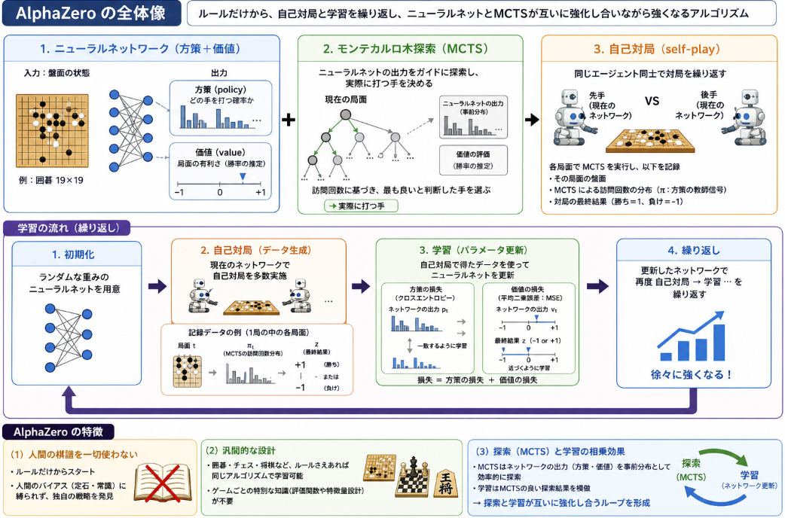

先日記事に引き続きMARLではない強化学習のトライアルとして囲碁の試行をしていきたいと思います。


囲碁（Go）は、**盤面が大きく（9×9〜19×19）、行動空間が膨大で、評価が終局まで分かりにくい**という特徴があるため、**単純な価値反復（Q学習、SAC など）では性能が出にくい**です。

以下に、囲碁環境での学習に適したアルゴリズムを、**難易度・実装コスト・性能**の観点から整理します。

## 囲碁を解くとされているアルゴリズム
強化学習手法で囲碁に向いてそうなアルゴリズムについて調査を行いました。

### 1. AlphaGo / AlphaZero 系（MCTS + ニューラルネットワーク）

**推奨度：★★★★★（最も適している）**

- **AlphaGo**: 教師あり学習（プロ棋譜）＋強化学習（自己対戦）＋MCTS
- **AlphaZero**: 完全な自己対戦強化学習＋MCTS（教師データ不要）

__理由__

- [**MCTS（モンテカルロ木探索）**](https://yoshishinnze.hatenablog.com/entry/2026/04/28/050000)により、長期的な読みを効率的に近似できる。
- **ニューラルネットワーク**で盤面評価と方策を同時に学習し、探索をガイドする。
- 囲碁のような**分枝因子が大きく、評価が遅いゲーム**に非常に適している。

__実装のポイント（OpenSpiel 環境向け）__

- OpenSpiel には `mcts.py` があり、**MCTS ベースのアルゴリズム**が実装されています。
- ニューラルネットワークは以下の2つを出力するように設計：
  - **方策ネットワーク（policy）**: 各行動の確率分布
  - **価値ネットワーク（value）**: 盤面の勝率評価
- 自己対戦（self-play）でデータを生成し、MCTS＋NN を交互に更新。

### 2. PPO（離散版）＋自己対戦

**推奨度：★★★☆☆（実装は比較的簡単だが性能は限定的）**

- **PPO（Proximal Policy Optimization）** は、方策勾配法の一種で、離散行動空間に適用可能。
- **自己対戦（self-play）**で対戦相手を更新しながら学習。

__メリット__

- 実装が比較的シンプル（既存の PPO 実装を流用可能）。
- SAC より安定しやすい。

__デメリット__

- 囲碁のような複雑なゲームでは、**探索効率が MCTS に劣る**。
- 長期的な読みが弱く、終局まで見通した評価が難しい。

### 3. SAC / DQN 系（単純価値反復）

**推奨度：★★☆☆☆（囲碁には不向き）**

- **SAC（Soft Actor-Critic）**: 連続行動向けだが、離散版も可能。
- **DQN / Categorical DQN**: 離散行動向けの価値反復。

__なぜ不向きか__

- 囲碁は**行動空間が膨大**（9路盤で 81+1=82 行動）で、**探索が困難**。
- 一手ごとの報酬がほぼ 0 で、**クレジット割り当てが極めて難しい**。
- 終局まで読む必要があるが、**価値反復だけでは長期的な読みが弱い**。

__結論__

- 囲碁で SAC や DQN をそのまま使うのは、**研究目的や学習実験**としては可能ですが、**実用的な強さを目指すなら不向き**です。

### 4. アルゴリズム選定のまとめ
ここまでの調査結果をまとめました。その上で今回の環境を解くためのアルゴリズムとしては**AlphaZero の実装を目指す**とします。

囲碁を確実に解いたアルゴリズムという実績があるのはAlphaZeroです。
- OpenSpiel の `mcts.py` を利用し、MCTS ベースの探索を実装。
- PyTorch などでニューラルネットワーク（policy + value）を構築。
- 自己対戦でデータを生成し、MCTS＋NN を交互に更新。

| アルゴリズム               | 囲碁への適性 | 実装難易度 | 期待性能   | 備考                 |
| -------------------------- | ------------ | ---------- | ---------- | -------------------- |
| AlphaZero 風（MCTS+NN）    | ★★★★★   | 高         | 非常に高い | 囲碁に最も適した手法 |
| AlphaGo 風（教師あり＋RL） | ★★★★☆   | 高         | 高い       | プロ棋譜が必要       |
| PPO＋自己対戦              | ★★★☆☆   | 中         | 中程度     | 実装は比較的簡単     |
| SAC / DQN 系               | ★☆☆☆☆   | 低〜中     | 低い       | 研究・実験向け       |

## AlphaZeroとは
AlphaZero は、**完全情報ゲーム（囲碁・将棋・チェスなど）を自己対局だけで強くする強化学習アルゴリズム**です。  
DeepMind が 2017 年に発表した AlphaGo Zero を一般化したもので、**人間の棋譜を一切使わず**、ルールだけから強くなります。



### 1. アルゴリズムの全体像

AlphaZero は、以下の 3 つの要素を組み合わせています。

1. **ニューラルネットワーク（方策＋価値）**  
   - 入力：盤面（例：囲碁の 19×19 の石の配置）
   - 出力：
     - **方策（policy）**：どの手を打つ確率が高いか
     - **価値（value）**：今の局面がどれだけ有利か（勝率の推定）
2. **モンテカルロ木探索（MCTS）**  
   - ニューラルネットの出力をガイドにしながら、将来の手をシミュレーションし、**実際に打つ手**を決める。
3. **自己対局（self-play）**  
   - 同じエージェント同士で対局を繰り返し、その棋譜を使ってニューラルネットを更新する。

### 2. 学習の流れ（ざっくり）

1. **初期化**  
   - ランダムな重みのニューラルネットを用意する。
2. **自己対局**  
   - 現在のネットワークを使って、AlphaZero 同士で対局を行う。
   - 各局面で MCTS を実行し、**実際に打たれた手**と、**MCTS の訪問回数に基づく確率分布**を記録。
3. **学習（パラメータ更新）**  
   - 自己対局で得た局面と、そのときの MCTS の確率分布を教師データとして、ニューラルネットを更新。
   - 損失関数はおおむね：
     - 方策出力と MCTS の分布の誤差（クロスエントロピー）
     - 価値出力と実際の勝敗（勝ち=1, 負け=-1）の誤差（MSE）
4. **繰り返し**  
   - 更新したネットワークで再度自己対局 → 学習 → … を繰り返し、徐々に強くなる。

### 3. AlphaZero の特徴

__(1) 人間の棋譜を一切使わない__
- 従来の AlphaGo はプロ棋士の棋譜から学んでいましたが、AlphaZero は**ルールだけ**からスタートします。
- そのため、人間のバイアス（定石や常識）に縛られず、独自の戦略を発見できます。

__(2) 汎用的な設計__
- 囲碁だけでなく、チェスや将棋など、**ルールさえ与えれば同じアルゴリズムで学習**できます。
- ゲームごとに特別な知識（評価関数や特徴量設計）を入れなくてよいのが大きな特徴です。

__(3) 強力な探索（MCTS）と学習の組み合わせ__
- MCTS はニューラルネットの出力（方策・価値）を**事前分布**として使い、効率的に探索します。
- 学習では、MCTS の結果を**教師信号**としてネットワークを更新し、ネットワークが MCTS の「良い探索結果」を模倣するようにします。
- これにより、**探索と学習が互いに強化し合う**ループができます。

### 4. AlphaZero と AlphaGo Zero の違い

- **AlphaGo Zero**：囲碁専用（Go 専用）の自己対局型 AlphaGo。
- **AlphaZero**：AlphaGo Zero のアイデアを**一般化**し、チェス・将棋にも適用したもの。

実質的には「AlphaGo Zero をゲーム非依存にしたものが AlphaZero」と理解して差し支えありません。


## 実装の方向性（OpenSpiel 環境向け）

公式リファレンス[OpenSpiel AlphaZero docs](https://openspiel.readthedocs.io/en/stable/alpha_zero.html)見ながら実装したのはこれです。
基本はラッパー任せでした。
非常にコンパクト。

```python
import os
import pyspiel
from open_spiel.python.algorithms.alpha_zero import alpha_zero

# 1. ゲームの設定
game_name = "go"
game_params = {"board_size": 9, "komi": 7.5}
game = pyspiel.load_game(game_name, game_params)

def train():
    # 2. Config の構築 (全必須引数を網羅)
    config_args = {
        "game": game_name,
        "path": "/tmp/alpha_zero_go",
        "nn_model": "resnet",
        "nn_width": 128,
        "nn_depth": 10,
        "train_batch_size": 128,
        "replay_buffer_size": 2**14,
        "replay_buffer_reuse": 4,
        "learning_rate": 0.01,
        "weight_decay": 1e-4,
        "decouple_weight_decay": False,
        "checkpoint_freq": 100,
        "actors": 4,           # 並列自己対局数
        "evaluators": 1,       # 評価スレッド数
        "evaluation_window": 100,
        "eval_levels": 7,
        "uct_c": 2.0,
        "max_simulations": 400,
        "policy_alpha": 1.0,
        "policy_epsilon": 0.25,
        "temperature": 1.0,
        "temperature_drop": 20,
        "observation_shape": game.observation_tensor_shape(),
        "output_size": game.num_distinct_actions(),
        "max_steps": 10000,
        "quiet": False,
        "verbose": True
    }
    config = alpha_zero.Config(**config_args)

    print("Starting AlphaZero orchestrator for 9x9 Go...")
    
    # 3. 学習の実行
    # 手動でモデルや学習ループを作らず、オーケストレーター関数に Config を丸投げします。
    # この関数を実行するだけで、指定した max_steps (10000) まで自動で学習が進みます。
    alpha_zero.alpha_zero(config)
    
    print("Training finished!")

if __name__ == "__main__":
    save_path = "/tmp/alpha_zero_go"
    if not os.path.exists(save_path):
        os.makedirs(save_path)
    train()
```

## 結論

**囲碁環境で学習を行う上で最も適したアルゴリズムは、AlphaGo / AlphaZero 系（MCTS＋ニューラルネットワーク）** です。
OpenSpiel 環境であれば、MCTS とニューラルネットワークを組み合わせた自己対戦強化学習が実装しやすく、性能も期待できます。

もし「AlphaZero 風の実装例」や「PPO で囲碁を学習する具体的なコード」が必要でしたら、その点を指定していただければ詳しく説明します。


